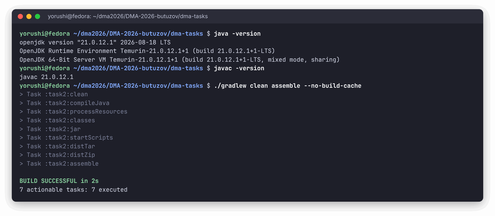
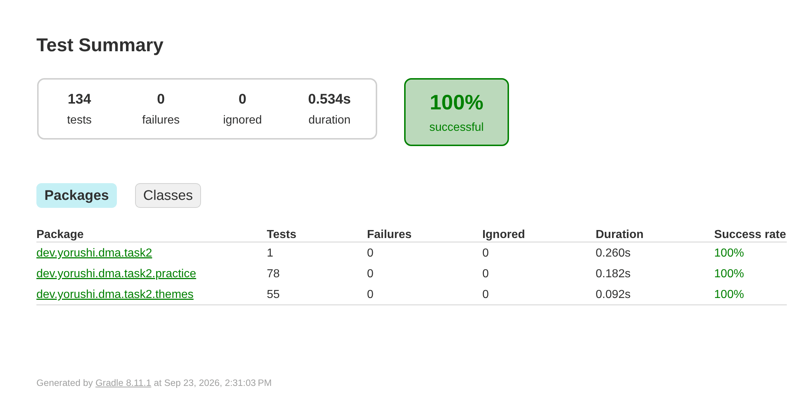
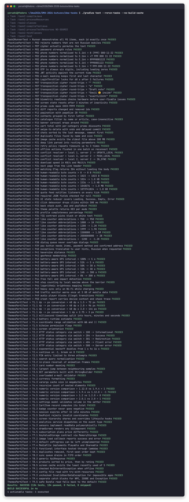
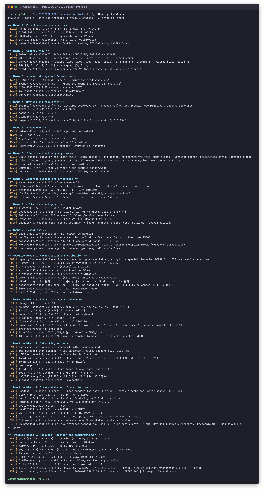

# DMA-2026 — Practical work 2: Java for Android

Semyon Butuzov (yorushi), group P24-3.2 · assignment: [`task_2.md`](https://github.com/U5er01Task/DMA-2026/blob/main/task_2.md)

All **95 items** of the assignment are implemented in plain Java: the **45 theme exercises**
(themes 1–9, five each) and the **50 practical items** (blocks 1–5). Every item is
demonstrated by a console runner and covered by JUnit 5 tests.

| | |
|---|---|
| Items implemented | 95 / 95 |
| Unit tests | 134 cases, all passing |
| Language level | Java 17 (`--release 17`), built with JDK 21 |
| Build | Gradle 8.11.1 wrapper, no Android SDK required |

## Running it

Only a JDK 17+ is needed; the Gradle wrapper downloads everything else.

```bash
cd dma-tasks
./gradlew :task2:run     # demonstrates every item and prints "Items demonstrated: 95 / 95"
./gradlew :task2:test    # runs the unit tests and prints a totals line
./gradlew build          # compile, test and package in one go
```

The runner exits with status 1 if any item is missing from its output, and a dedicated test
(`Task2RunnerTest`) checks that each of the 95 item ids appears exactly once.

## Screenshots

Terminal output was captured from real runs in a shell where only the JDK was on the `PATH`,
then rendered to images; the text is unchanged, only colour was added.

**Compilation** — `javac` 21, `-Xlint:all` enabled, zero warnings:



**JUnit report** generated by Gradle:



**Every test case** (`--rerun-tasks --no-build-cache`, so nothing is served from cache; the
blank lines Gradle prints between test events are collapsed to fit the image):



**The code working** — the runner demonstrating all 95 items:



## Project layout

```
dma-tasks/
├── settings.gradle.kts, gradle/            build configuration and version catalog
└── task2/
    ├── src/main/java/dev/yorushi/dma/task2/
    │   ├── themes/     Theme1Primitives … Theme9Exceptions   (items T1.1–T9.5)
    │   ├── practice/   Block1Auth … Block5Hardware           (items P01–P50)
    │   ├── Task2Runner.java   entry point demonstrating every item
    │   ├── Report.java        output shared by all demos
    │   └── MutableClock.java  manually advanced clock for time-based items
    ├── src/main/resources/…/ErrorMessages{,_ru}.properties
    └── src/test/java/…    ThemesPart1Test, ThemesPart2Test,
                           PracticePart1Test, PracticePart2Test, Task2RunnerTest
```

Each theme or block is one file; every item inside it starts with a Javadoc tagged with its
id (`T3.2:`, `P17:`), so an item can be found by searching for its number.

## Design notes

- **Deterministic by construction.** Everything that depends on time takes a `java.time.Clock`,
  randomness takes a `Random`, and retry pauses take a `Sleeper`. Tests and the runner advance a
  `MutableClock` instead of sleeping, so a 60-second lockout (P06) or a 15-minute session (T5.4)
  is checked instantly and reproducibly.
- **Money uses `BigDecimal`** (P16): binary floating point cannot represent kopecks exactly.
- **Android compatibility.** The module compiles with `--release 17` and avoids JDK APIs missing
  on older Android versions (for example the `URLEncoder` `Charset` overload, `List.of`), so it can
  later be embedded in the Android app of tasks 3–4 unchanged.
- **Localisation instead of hard-coded Russian** (P40): the assignment asks for Russian error
  hints. They live in a standard `ResourceBundle` — `ErrorMessages.properties` (English default)
  and `ErrorMessages_ru.properties` — written with `\u` escapes, because Android reads
  property bundles as ISO-8859-1.

### Deliberate interpretations

Where the assignment is ambiguous or its example is inconsistent, the choice is documented in
the code as well:

| Item | Decision |
|---|---|
| P05 | The example masks a 14-character segment with 11 asterisks, which no consistent rule produces. The mask keeps the first and last character and hides the rest one-for-one. |
| P12 | Pages are numbered from 1, as shown to the user. |
| P19 | Duplicates are matched by name and size, as the text specifies; this is the cheap pre-filter before hashing. |
| P22 | Only `SocketTimeoutException` is retried; other failures are not transient and are rethrown at once. |
| P24 | Equal versions are reported as `IN_SYNC` rather than pushed, avoiding a redundant write. |
| P48 | The 5 GB limit applies to mobile data, per the item title; Wi-Fi is counted separately. |
| T9.5 | `android.os.Bundle` is not available on a plain JVM, so the Bundle is modelled as a `Map`; the failure handling is the same. |

## Item index

Generated from the sources: each link points to the line where the item is implemented and to
its test.

### Theme exercises (45)

| Item | What it does | Implementation | Test |
|---|---|---|---|
| T1.1 | dp -> px conversion | [`Theme1Primitives.dpToPx`](task2/src/main/java/dev/yorushi/dma/task2/themes/Theme1Primitives.java#L15) | [`ThemesPart1Test`](task2/src/test/java/dev/yorushi/dma/task2/themes/ThemesPart1Test.java#L35) |
| T1.2 | millisecond timestamp split into hours, minutes and seconds | [`Theme1Primitives.TimeBreakdown`](task2/src/main/java/dev/yorushi/dma/task2/themes/Theme1Primitives.java#L25) | [`ThemesPart1Test`](task2/src/test/java/dev/yorushi/dma/task2/themes/ThemesPart1Test.java#L42) |
| T1.3 | battery runtime estimate | [`Theme1Primitives.batteryLifeHours`](task2/src/main/java/dev/yorushi/dma/task2/themes/Theme1Primitives.java#L47) | [`ThemesPart1Test`](task2/src/test/java/dev/yorushi/dma/task2/themes/ThemesPart1Test.java#L52) |
| T1.4 | coordinate range validation with && and \|\| | [`Theme1Primitives.isValidCoordinate`](task2/src/main/java/dev/yorushi/dma/task2/themes/Theme1Primitives.java#L61) | [`ThemesPart1Test`](task2/src/test/java/dev/yorushi/dma/task2/themes/ThemesPart1Test.java#L59) |
| T1.5 | bitwise permission flags | [`Theme1Primitives.PermissionFlags`](task2/src/main/java/dev/yorushi/dma/task2/themes/Theme1Primitives.java#L70) | [`ThemesPart1Test`](task2/src/test/java/dev/yorushi/dma/task2/themes/ThemesPart1Test.java#L69) |
| T2.1 | screen orientation | [`Theme2ControlFlow.orientation`](task2/src/main/java/dev/yorushi/dma/task2/themes/Theme2ControlFlow.java#L19) | [`ThemesPart1Test`](task2/src/test/java/dev/yorushi/dma/task2/themes/ThemesPart1Test.java#L82) |
| T2.2 | HTTP status category via switch | [`Theme2ControlFlow.httpCategory`](task2/src/main/java/dev/yorushi/dma/task2/themes/Theme2ControlFlow.java#L32) | [`ThemesPart1Test`](task2/src/test/java/dev/yorushi/dma/task2/themes/ThemesPart1Test.java#L91) |
| T2.3 | exponential backoff doubles from 1 s to 16 s | [`Theme2ControlFlow.backoffDelays`](task2/src/main/java/dev/yorushi/dma/task2/themes/Theme2ControlFlow.java#L51) | [`ThemesPart1Test`](task2/src/test/java/dev/yorushi/dma/task2/themes/ThemesPart1Test.java#L97) |
| T2.4 | continue on -1, break on 0 | [`Theme2ControlFlow.readMessageIds`](task2/src/main/java/dev/yorushi/dma/task2/themes/Theme2ControlFlow.java#L66) | [`ThemesPart1Test`](task2/src/test/java/dev/yorushi/dma/task2/themes/ThemesPart1Test.java#L104) |
| T2.5 | PIN entry limited to three attempts | [`Theme2ControlFlow.enterPin`](task2/src/main/java/dev/yorushi/dma/task2/themes/Theme2ControlFlow.java#L87) | [`ThemesPart1Test`](task2/src/test/java/dev/yorushi/dma/task2/themes/ThemesPart1Test.java#L110) |
| T3.1 | search query normalisation | [`Theme3ArraysStrings.normalizeQuery`](task2/src/main/java/dev/yorushi/dma/task2/themes/Theme3ArraysStrings.java#L19) | [`ThemesPart1Test`](task2/src/test/java/dev/yorushi/dma/task2/themes/ThemesPart1Test.java#L123) |
| T3.2 | in-place reversal of animation frames | [`Theme3ArraysStrings.reverseInPlace`](task2/src/main/java/dev/yorushi/dma/task2/themes/Theme3ArraysStrings.java#L29) | [`ThemesPart1Test`](task2/src/test/java/dev/yorushi/dma/task2/themes/ThemesPart1Test.java#L130) |
| T3.3 | card number masking | [`Theme3ArraysStrings.maskCardNumber`](task2/src/main/java/dev/yorushi/dma/task2/themes/Theme3ArraysStrings.java#L40) | [`ThemesPart1Test`](task2/src/test/java/dev/yorushi/dma/task2/themes/ThemesPart1Test.java#L141) |
| T3.4 | largest jump between neighbouring samples | [`Theme3ArraysStrings.maxSpike`](task2/src/main/java/dev/yorushi/dma/task2/themes/Theme3ArraysStrings.java#L51) | [`ThemesPart1Test`](task2/src/test/java/dev/yorushi/dma/task2/themes/ThemesPart1Test.java#L148) |
| T3.5 | GET parameters built with StringBuilder | [`Theme3ArraysStrings.buildQuery`](task2/src/main/java/dev/yorushi/dma/task2/themes/Theme3ArraysStrings.java#L65) | [`ThemesPart1Test`](task2/src/test/java/dev/yorushi/dma/task2/themes/ThemesPart1Test.java#L154) |
| T4.1 | overloaded e-mail validator | [`Theme4Methods.isValid`](task2/src/main/java/dev/yorushi/dma/task2/themes/Theme4Methods.java#L26) | [`ThemesPart1Test`](task2/src/test/java/dev/yorushi/dma/task2/themes/ThemesPart1Test.java#L164) |
| T4.2 | currency formatting | [`Theme4Methods.formatPrice`](task2/src/main/java/dev/yorushi/dma/task2/themes/Theme4Methods.java#L45) | [`ThemesPart1Test`](task2/src/test/java/dev/yorushi/dma/task2/themes/ThemesPart1Test.java#L173) |
| T4.3 | varargs cache size in megabytes | [`Theme4Methods.calculateCache`](task2/src/main/java/dev/yorushi/dma/task2/themes/Theme4Methods.java#L56) | [`ThemesPart1Test`](task2/src/test/java/dev/yorushi/dma/task2/themes/ThemesPart1Test.java#L180) |
| T4.4 | recursive count of nested elements | [`Theme4Methods.countNested`](task2/src/main/java/dev/yorushi/dma/task2/themes/Theme4Methods.java#L97) | [`ThemesPart1Test`](task2/src/test/java/dev/yorushi/dma/task2/themes/ThemesPart1Test.java#L187) |
| T4.5 | numeric version comparison | [`Theme4Methods.compareVersions`](task2/src/main/java/dev/yorushi/dma/task2/themes/Theme4Methods.java#L111) | [`ThemesPart1Test`](task2/src/test/java/dev/yorushi/dma/task2/themes/ThemesPart1Test.java#L198) |
| T5.1 | settings model validates volume in the setter | [`Theme5Encapsulation.SettingsModel`](task2/src/main/java/dev/yorushi/dma/task2/themes/Theme5Encapsulation.java#L20) | [`ThemesPart1Test`](task2/src/test/java/dev/yorushi/dma/task2/themes/ThemesPart1Test.java#L206) |
| T5.2 | CartItem record computes its total | [`Theme5Encapsulation.CartItem`](task2/src/main/java/dev/yorushi/dma/task2/themes/Theme5Encapsulation.java#L59) | [`ThemesPart1Test`](task2/src/test/java/dev/yorushi/dma/task2/themes/ThemesPart1Test.java#L217) |
| T5.3 | badge counter never goes negative | [`Theme5Encapsulation.BadgeCounter`](task2/src/main/java/dev/yorushi/dma/task2/themes/Theme5Encapsulation.java#L79) | [`ThemesPart1Test`](task2/src/test/java/dev/yorushi/dma/task2/themes/ThemesPart1Test.java#L224) |
| T5.4 | session expires after 15 idle minutes | [`Theme5Encapsulation.SessionTracker`](task2/src/main/java/dev/yorushi/dma/task2/themes/Theme5Encapsulation.java#L107) | [`ThemesPart1Test`](task2/src/test/java/dev/yorushi/dma/task2/themes/ThemesPart1Test.java#L236) |
| T5.5 | GeoPoint rejects invalid coordinates | [`Theme5Encapsulation.GeoPoint`](task2/src/main/java/dev/yorushi/dma/task2/themes/Theme5Encapsulation.java#L136) | [`ThemesPart1Test`](task2/src/test/java/dev/yorushi/dma/task2/themes/ThemesPart1Test.java#L249) |
| T6.1 | screen hierarchy shares and overrides lifecycle hooks | [`Theme6Inheritance.BaseScreen`](task2/src/main/java/dev/yorushi/dma/task2/themes/Theme6Inheritance.java#L18) | [`ThemesPart2Test`](task2/src/test/java/dev/yorushi/dma/task2/themes/ThemesPart2Test.java#L59) |
| T6.2 | analytics service dispatches on the event type | [`Theme6Inheritance.AnalyticsEvent`](task2/src/main/java/dev/yorushi/dma/task2/themes/Theme6Inheritance.java#L77) | [`ThemesPart2Test`](task2/src/test/java/dev/yorushi/dma/task2/themes/ThemesPart2Test.java#L72) |
| T6.3 | sensors implement readData polymorphically | [`Theme6Inheritance.DeviceSensor`](task2/src/main/java/dev/yorushi/dma/task2/themes/Theme6Inheritance.java#L140) | [`ThemesPart2Test`](task2/src/test/java/dev/yorushi/dma/task2/themes/ThemesPart2Test.java#L83) |
| T6.4 | drawScreen renders any UiComponent | [`Theme6Inheritance.UiComponent`](task2/src/main/java/dev/yorushi/dma/task2/themes/Theme6Inheritance.java#L174) | [`ThemesPart2Test`](task2/src/test/java/dev/yorushi/dma/task2/themes/ThemesPart2Test.java#L92) |
| T6.5 | subscription plans price differently | [`Theme6Inheritance.Subscription`](task2/src/main/java/dev/yorushi/dma/task2/themes/Theme6Inheritance.java#L224) | [`ThemesPart2Test`](task2/src/test/java/dev/yorushi/dma/task2/themes/ThemesPart2Test.java#L100) |
| T7.1 | KeyValueStorage contract via MemoryStorage | [`Theme7Interfaces.KeyValueStorage`](task2/src/main/java/dev/yorushi/dma/task2/themes/Theme7Interfaces.java#L18) | [`ThemesPart2Test`](task2/src/test/java/dev/yorushi/dma/task2/themes/ThemesPart2Test.java#L114) |
| T7.2 | image load callback reports success and error | [`Theme7Interfaces.ImageLoadCallback`](task2/src/main/java/dev/yorushi/dma/task2/themes/Theme7Interfaces.java#L49) | [`ThemesPart2Test`](task2/src/test/java/dev/yorushi/dma/task2/themes/ThemesPart2Test.java#L124) |
| T7.3 | default onProgress can be left unimplemented | [`Theme7Interfaces.BackgroundTaskListener`](task2/src/main/java/dev/yorushi/dma/task2/themes/Theme7Interfaces.java#L67) | [`ThemesPart2Test`](task2/src/test/java/dev/yorushi/dma/task2/themes/ThemesPart2Test.java#L144) |
| T7.4 | MediaFile implements Playable and Shareable | [`Theme7Interfaces.MediaFile`](task2/src/main/java/dev/yorushi/dma/task2/themes/Theme7Interfaces.java#L96) | [`ThemesPart2Test`](task2/src/test/java/dev/yorushi/dma/task2/themes/ThemesPart2Test.java#L153) |
| T7.5 | functional interface tested through lambdas | [`Theme7Interfaces.PredicateValidator`](task2/src/main/java/dev/yorushi/dma/task2/themes/Theme7Interfaces.java#L130) | [`ThemesPart2Test`](task2/src/test/java/dev/yorushi/dma/task2/themes/ThemesPart2Test.java#L166) |
| T8.1 | duplicates removed, first-seen order kept | [`Theme8Collections.dedupeContacts`](task2/src/main/java/dev/yorushi/dma/task2/themes/Theme8Collections.java#L24) | [`ThemesPart2Test`](task2/src/test/java/dev/yorushi/dma/task2/themes/ThemesPart2Test.java#L178) |
| T8.2 | sync queue drains in FIFO order | [`Theme8Collections.SyncQueue`](task2/src/main/java/dev/yorushi/dma/task2/themes/Theme8Collections.java#L31) | [`ThemesPart2Test`](task2/src/test/java/dev/yorushi/dma/task2/themes/ThemesPart2Test.java#L185) |
| T8.3 | generic ApiResponse | [`Theme8Collections.ApiResponse`](task2/src/main/java/dev/yorushi/dma/task2/themes/Theme8Collections.java#L57) | [`ThemesPart2Test`](task2/src/test/java/dev/yorushi/dma/task2/themes/ThemesPart2Test.java#L198) |
| T8.4 | products sorted by price, then by rating | [`Theme8Collections.sortCatalog`](task2/src/main/java/dev/yorushi/dma/task2/themes/Theme8Collections.java#L103) | [`ThemesPart2Test`](task2/src/test/java/dev/yorushi/dma/task2/themes/ThemesPart2Test.java#L209) |
| T8.5 | screen cache evicts the least recently used of 5 | [`Theme8Collections.ScreenCache`](task2/src/main/java/dev/yorushi/dma/task2/themes/Theme8Collections.java#L116) | [`ThemesPart2Test`](task2/src/test/java/dev/yorushi/dma/task2/themes/ThemesPart2Test.java#L218) |
| T9.1 | checked NoInternetException when offline | [`Theme9Exceptions.NoInternetException`](task2/src/main/java/dev/yorushi/dma/task2/themes/Theme9Exceptions.java#L25) | [`ThemesPart2Test`](task2/src/test/java/dev/yorushi/dma/task2/themes/ThemesPart2Test.java#L234) |
| T9.2 | config file read with try-with-resources | [`Theme9Exceptions.readConfig`](task2/src/main/java/dev/yorushi/dma/task2/themes/Theme9Exceptions.java#L41) | [`ThemesPart2Test`](task2/src/test/java/dev/yorushi/dma/task2/themes/ThemesPart2Test.java#L241) |
| T9.3 | unchecked InvalidUserDataException for impossible ages | [`Theme9Exceptions.InvalidUserDataException`](task2/src/main/java/dev/yorushi/dma/task2/themes/Theme9Exceptions.java#L63) | [`ThemesPart2Test`](task2/src/test/java/dev/yorushi/dma/task2/themes/ThemesPart2Test.java#L258) |
| T9.4 | separate catch blocks for NPE, IOOBE and Exception | [`Theme9Exceptions.classifyFailure`](task2/src/main/java/dev/yorushi/dma/task2/themes/Theme9Exceptions.java#L89) | [`ThemesPart2Test`](task2/src/test/java/dev/yorushi/dma/task2/themes/ThemesPart2Test.java#L267) |
| T9.5 | safe Bundle read falls back to the default | [`Theme9Exceptions.getStringSafe`](task2/src/main/java/dev/yorushi/dma/task2/themes/Theme9Exceptions.java#L109) | [`ThemesPart2Test`](task2/src/test/java/dev/yorushi/dma/task2/themes/ThemesPart2Test.java#L280) |

### Practical items (50)

| Item | What it does | Implementation | Test |
|---|---|---|---|
| P01 | password strength rules | [`Block1Auth.passwordViolations`](task2/src/main/java/dev/yorushi/dma/task2/practice/Block1Auth.java#L25) | [`PracticePart1Test`](task2/src/test/java/dev/yorushi/dma/task2/practice/PracticePart1Test.java#L44) |
| P02 | phone numbers normalised to E.164 | [`Block1Auth.toE164`](task2/src/main/java/dev/yorushi/dma/task2/practice/Block1Auth.java#L53) | [`PracticePart1Test`](task2/src/test/java/dev/yorushi/dma/task2/practice/PracticePart1Test.java#L54) |
| P03 | OTP is always six digits, including leading zeros | [`Block1Auth.generateOtp`](task2/src/main/java/dev/yorushi/dma/task2/practice/Block1Auth.java#L67) | [`PracticePart1Test`](task2/src/test/java/dev/yorushi/dma/task2/practice/PracticePart1Test.java#L66) |
| P04 | JWT activity against the current time | [`Block1Auth.isTokenActive`](task2/src/main/java/dev/yorushi/dma/task2/practice/Block1Auth.java#L78) | [`PracticePart1Test`](task2/src/test/java/dev/yorushi/dma/task2/practice/PracticePart1Test.java#L85) |
| P05 | e-mail masking keeps first and last character | [`Block1Auth.maskEmail`](task2/src/main/java/dev/yorushi/dma/task2/practice/Block1Auth.java#L89) | [`PracticePart1Test`](task2/src/test/java/dev/yorushi/dma/task2/practice/PracticePart1Test.java#L93) |
| P06 | LoginThrottler locks for 60 s after 5 failures | [`Block1Auth.LoginThrottler`](task2/src/main/java/dev/yorushi/dma/task2/practice/Block1Auth.java#L110) | [`PracticePart1Test`](task2/src/test/java/dev/yorushi/dma/task2/practice/PracticePart1Test.java#L101) |
| P07 | transposition cipher round-trips | [`Block1Auth.TranspositionCipher`](task2/src/main/java/dev/yorushi/dma/task2/practice/Block1Auth.java#L155) | [`PracticePart1Test`](task2/src/test/java/dev/yorushi/dma/task2/practice/PracticePart1Test.java#L119) |
| P08 | biometric readiness checks hardware before user-fixable issues | [`Block1Auth.biometricReadiness`](task2/src/main/java/dev/yorushi/dma/task2/practice/Block1Auth.java#L197) | [`PracticePart1Test`](task2/src/test/java/dev/yorushi/dma/task2/practice/PracticePart1Test.java#L132) |
| P09 | screen state resets after 3 minutes of inactivity | [`Block1Auth.InactivityTimeout`](task2/src/main/java/dev/yorushi/dma/task2/practice/Block1Auth.java#L214) | [`PracticePart1Test`](task2/src/test/java/dev/yorushi/dma/task2/practice/PracticePart1Test.java#L142) |
| P10 | promo code mask XXXX-9999 | [`Block1Auth.isValidPromoCode`](task2/src/main/java/dev/yorushi/dma/task2/practice/Block1Auth.java#L247) | [`PracticePart1Test`](task2/src/test/java/dev/yorushi/dma/task2/practice/PracticePart1Test.java#L157) |
| P11 | diff reports changed and removed ids | [`Block2Lists.diffNews`](task2/src/main/java/dev/yorushi/dma/task2/practice/Block2Lists.java#L39) | [`PracticePart1Test`](task2/src/test/java/dev/yorushi/dma/task2/practice/PracticePart1Test.java#L169) |
| P12 | pagination with pageSize 20 | [`Block2Lists.PaginationHelper`](task2/src/main/java/dev/yorushi/dma/task2/practice/Block2Lists.java#L60) | [`PracticePart1Test`](task2/src/test/java/dev/yorushi/dma/task2/practice/PracticePart1Test.java#L179) |
| P13 | contacts grouped by first letter | [`Block2Lists.groupByFirstLetter`](task2/src/main/java/dev/yorushi/dma/task2/practice/Block2Lists.java#L95) | [`PracticePart1Test`](task2/src/test/java/dev/yorushi/dma/task2/practice/PracticePart1Test.java#L195) |
| P14 | catalogue filter by name or article, case-insensitive | [`Block2Lists.filterCatalog`](task2/src/main/java/dev/yorushi/dma/task2/practice/Block2Lists.java#L117) | [`PracticePart1Test`](task2/src/test/java/dev/yorushi/dma/task2/practice/PracticePart1Test.java#L205) |
| P15 | banner carousel wraps around | [`Block2Lists.nextBanner`](task2/src/main/java/dev/yorushi/dma/task2/practice/Block2Lists.java#L135) | [`PracticePart1Test`](task2/src/test/java/dev/yorushi/dma/task2/practice/PracticePart1Test.java#L215) |
| P16 | cart total with per-category promo discounts | [`Block2Lists.cartTotal`](task2/src/main/java/dev/yorushi/dma/task2/practice/Block2Lists.java#L153) | [`PracticePart1Test`](task2/src/test/java/dev/yorushi/dma/task2/practice/PracticePart1Test.java#L223) |
| P17 | swipe-to-delete with undo and delayed commit | [`Block2Lists.UndoBuffer`](task2/src/main/java/dev/yorushi/dma/task2/practice/Block2Lists.java#L170) | [`PracticePart1Test`](task2/src/test/java/dev/yorushi/dma/task2/practice/PracticePart1Test.java#L234) |
| P18 | chats sorted by the last message, newest first | [`Block2Lists.sortChats`](task2/src/main/java/dev/yorushi/dma/task2/practice/Block2Lists.java#L228) | [`PracticePart1Test`](task2/src/test/java/dev/yorushi/dma/task2/practice/PracticePart1Test.java#L253) |
| P19 | duplicate files found by name and size | [`Block2Lists.findDuplicates`](task2/src/main/java/dev/yorushi/dma/task2/practice/Block2Lists.java#L243) | [`PracticePart1Test`](task2/src/test/java/dev/yorushi/dma/task2/practice/PracticePart1Test.java#L262) |
| P20 | image cache evicts the oldest file above 100 MB | [`Block2Lists.ImageCache`](task2/src/main/java/dev/yorushi/dma/task2/practice/Block2Lists.java#L261) | [`PracticePart1Test`](task2/src/test/java/dev/yorushi/dma/task2/practice/PracticePart1Test.java#L272) |
| P21 | deep link parsed into routing parameters | [`Block3Network.parseDeepLink`](task2/src/main/java/dev/yorushi/dma/task2/practice/Block3Network.java#L37) | [`PracticePart2Test`](task2/src/test/java/dev/yorushi/dma/task2/practice/PracticePart2Test.java#L64) |
| P22 | retry policy repeats timeouts up to 3 times | [`Block3Network.withRetry`](task2/src/main/java/dev/yorushi/dma/task2/practice/Block3Network.java#L72) | [`PracticePart2Test`](task2/src/test/java/dev/yorushi/dma/task2/practice/PracticePart2Test.java#L76) |
| P23 | offline actions flushed in one batch on reconnect | [`Block3Network.OfflineActionQueue`](task2/src/main/java/dev/yorushi/dma/task2/practice/Block3Network.java#L94) | [`PracticePart2Test`](task2/src/test/java/dev/yorushi/dma/task2/practice/PracticePart2Test.java#L106) |
| P24 | conflict resolver | [`Block3Network.resolveConflict`](task2/src/main/java/dev/yorushi/dma/task2/practice/Block3Network.java#L134) | [`PracticePart2Test`](task2/src/test/java/dev/yorushi/dma/task2/practice/PracticePart2Test.java#L123) |
| P25 | download speed in KB/s and Mbit/s | [`Block3Network.downloadSpeed`](task2/src/main/java/dev/yorushi/dma/task2/practice/Block3Network.java#L147) | [`PracticePart2Test`](task2/src/test/java/dev/yorushi/dma/task2/practice/PracticePart2Test.java#L129) |
| P26 | next page from the Link header | [`Block3Network.nextPageFromLinkHeader`](task2/src/main/java/dev/yorushi/dma/task2/practice/Block3Network.java#L161) | [`PracticePart2Test`](task2/src/test/java/dev/yorushi/dma/task2/practice/PracticePart2Test.java#L138) |
| P27 | matching ETag returns 304 without loading the body | [`Block3Network.EtagEndpoint`](task2/src/main/java/dev/yorushi/dma/task2/practice/Block3Network.java#L179) | [`PracticePart2Test`](task2/src/test/java/dev/yorushi/dma/task2/practice/PracticePart2Test.java#L150) |
| P28 | human-readable byte counts | [`Block3Network.formatBytes`](task2/src/main/java/dev/yorushi/dma/task2/practice/Block3Network.java#L199) | [`PracticePart2Test`](task2/src/test/java/dev/yorushi/dma/task2/practice/PracticePart2Test.java#L165) |
| P29 | quote feed notifies listeners on every tick | [`Block3Network.QuoteListener`](task2/src/main/java/dev/yorushi/dma/task2/practice/Block3Network.java#L219) | [`PracticePart2Test`](task2/src/test/java/dev/yorushi/dma/task2/practice/PracticePart2Test.java#L171) |
| P30 | required JSON fields checked for null | [`Block3Network.missingRequiredFields`](task2/src/main/java/dev/yorushi/dma/task2/practice/Block3Network.java#L260) | [`PracticePart2Test`](task2/src/test/java/dev/yorushi/dma/task2/practice/PracticePart2Test.java#L185) |
| P31 | UI state reducer covers Loading, Success, Empty, Error | [`Block4UiState.UiState`](task2/src/main/java/dev/yorushi/dma/task2/practice/Block4UiState.java#L35) | [`PracticePart2Test`](task2/src/test/java/dev/yorushi/dma/task2/practice/PracticePart2Test.java#L199) |
| P32 | click debouncer drops clicks within 500 ms | [`Block4UiState.ClickDebouncer`](task2/src/main/java/dev/yorushi/dma/task2/practice/Block4UiState.java#L93) | [`PracticePart2Test`](task2/src/test/java/dev/yorushi/dma/task2/practice/PracticePart2Test.java#L208) |
| P33 | back stack push, pop and popToRoot | [`Block4UiState.BackStack`](task2/src/main/java/dev/yorushi/dma/task2/practice/Block4UiState.java#L118) | [`PracticePart2Test`](task2/src/test/java/dev/yorushi/dma/task2/practice/PracticePart2Test.java#L222) |
| P34 | theme palette returns HEX per mode | [`Block4UiState.ThemePalette`](task2/src/main/java/dev/yorushi/dma/task2/practice/Block4UiState.java#L179) | [`PracticePart2Test`](task2/src/test/java/dev/yorushi/dma/task2/practice/PracticePart2Test.java#L240) |
| P35 | profile completeness percentage | [`Block4UiState.profileCompleteness`](task2/src/main/java/dev/yorushi/dma/task2/practice/Block4UiState.java#L202) | [`PracticePart2Test`](task2/src/test/java/dev/yorushi/dma/task2/practice/PracticePart2Test.java#L250) |
| P36 | YIQ contrast picks black or white text | [`Block4UiState.readableTextOn`](task2/src/main/java/dev/yorushi/dma/task2/practice/Block4UiState.java#L218) | [`PracticePart2Test`](task2/src/test/java/dev/yorushi/dma/task2/practice/PracticePart2Test.java#L258) |
| P37 | like counter abbreviations | [`Block4UiState.formatCount`](task2/src/main/java/dev/yorushi/dma/task2/practice/Block4UiState.java#L229) | [`PracticePart2Test`](task2/src/test/java/dev/yorushi/dma/task2/practice/PracticePart2Test.java#L268) |
| P38 | dialog queue never overlaps dialogs | [`Block4UiState.DialogQueue`](task2/src/main/java/dev/yorushi/dma/task2/practice/Block4UiState.java#L249) | [`PracticePart2Test`](task2/src/test/java/dev/yorushi/dma/task2/practice/PracticePart2Test.java#L274) |
| P39 | pay button needs items, payment method and confirmed address | [`Block4UiState.isPayButtonEnabled`](task2/src/main/java/dev/yorushi/dma/task2/practice/Block4UiState.java#L287) | [`PracticePart2Test`](task2/src/test/java/dev/yorushi/dma/task2/practice/PracticePart2Test.java#L290) |
| P40 | exceptions translated to user hints, Russian when requested | [`Block4UiState.translateError`](task2/src/main/java/dev/yorushi/dma/task2/practice/Block4UiState.java#L298) | [`PracticePart2Test`](task2/src/test/java/dev/yorushi/dma/task2/practice/PracticePart2Test.java#L299) |
| P41 | haversine distance | [`Block5Hardware.haversineMeters`](task2/src/main/java/dev/yorushi/dma/task2/practice/Block5Hardware.java#L31) | [`PracticePart2Test`](task2/src/test/java/dev/yorushi/dma/task2/practice/PracticePart2Test.java#L316) |
| P42 | geofence membership | [`Block5Hardware.isInsideGeofence`](task2/src/main/java/dev/yorushi/dma/task2/practice/Block5Hardware.java#L44) | [`PracticePart2Test`](task2/src/test/java/dev/yorushi/dma/task2/practice/PracticePart2Test.java#L326) |
| P43 | battery-aware GPS interval | [`Block5Hardware.gpsIntervalSeconds`](task2/src/main/java/dev/yorushi/dma/task2/practice/Block5Hardware.java#L52) | [`PracticePart2Test`](task2/src/test/java/dev/yorushi/dma/task2/practice/PracticePart2Test.java#L335) |
| P44 | free fall and impact detection | [`Block5Hardware.detectFall`](task2/src/main/java/dev/yorushi/dma/task2/practice/Block5Hardware.java#L71) | [`PracticePart2Test`](task2/src/test/java/dev/yorushi/dma/task2/practice/PracticePart2Test.java#L341) |
| P45 | step counting by local maxima above the barrier | [`Block5Hardware.countSteps`](task2/src/main/java/dev/yorushi/dma/task2/practice/Block5Hardware.java#L87) | [`PracticePart2Test`](task2/src/test/java/dev/yorushi/dma/task2/practice/PracticePart2Test.java#L349) |
| P46 | logarithmic brightness mapping | [`Block5Hardware.brightnessPercent`](task2/src/main/java/dev/yorushi/dma/task2/practice/Block5Hardware.java#L105) | [`PracticePart2Test`](task2/src/test/java/dev/yorushi/dma/task2/practice/PracticePart2Test.java#L357) |
| P47 | heavy sync only on Wi-Fi while charging | [`Block5Hardware.canStartHeavySync`](task2/src/main/java/dev/yorushi/dma/task2/practice/Block5Hardware.java#L114) | [`PracticePart2Test`](task2/src/test/java/dev/yorushi/dma/task2/practice/PracticePart2Test.java#L366) |
| P48 | traffic monitor warns once at 5 GB of mobile data | [`Block5Hardware.TrafficMonitor`](task2/src/main/java/dev/yorushi/dma/task2/practice/Block5Hardware.java#L123) | [`PracticePart2Test`](task2/src/test/java/dev/yorushi/dma/task2/practice/PracticePart2Test.java#L374) |
| P49 | audio player blocks illegal transitions | [`Block5Hardware.AudioPlayer`](task2/src/main/java/dev/yorushi/dma/task2/practice/Block5Hardware.java#L156) | [`PracticePart2Test`](task2/src/test/java/dev/yorushi/dma/task2/practice/PracticePart2Test.java#L388) |
| P50 | crash report carries device context and stack trace | [`Block5Hardware.formatCrashReport`](task2/src/main/java/dev/yorushi/dma/task2/practice/Block5Hardware.java#L201) | [`PracticePart2Test`](task2/src/test/java/dev/yorushi/dma/task2/practice/PracticePart2Test.java#L404) |
