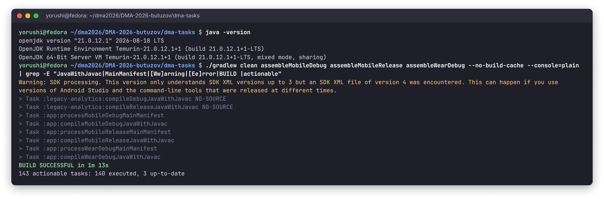
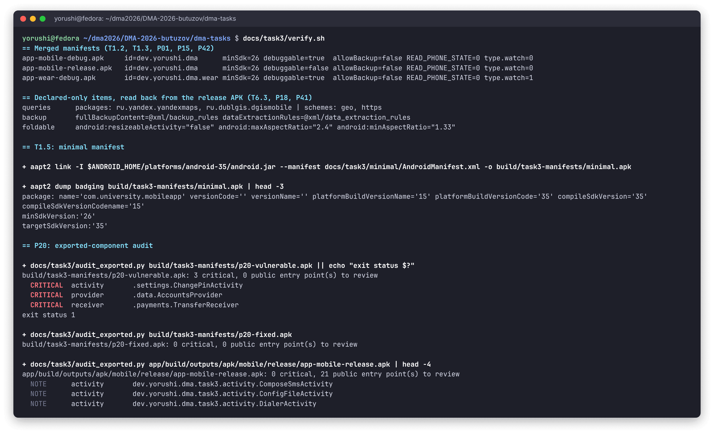
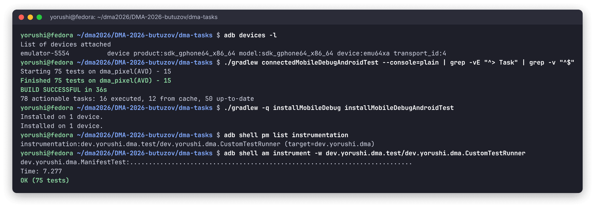
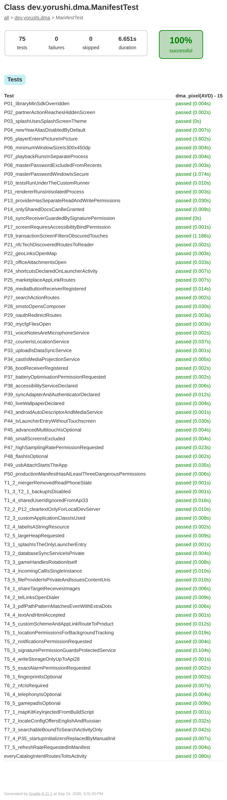
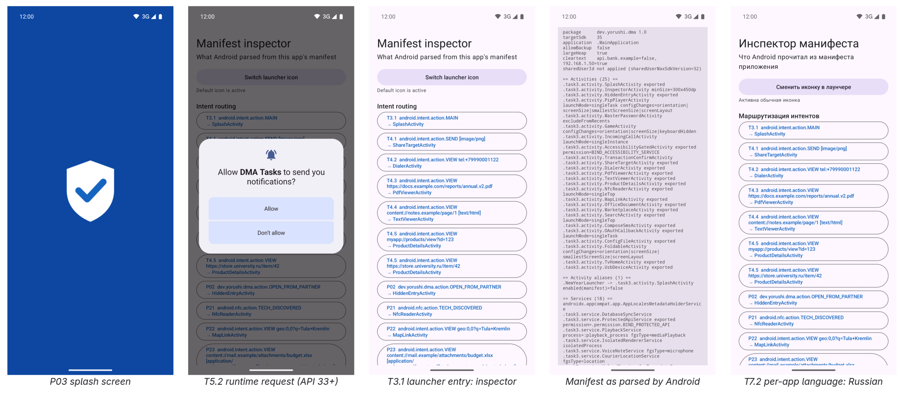
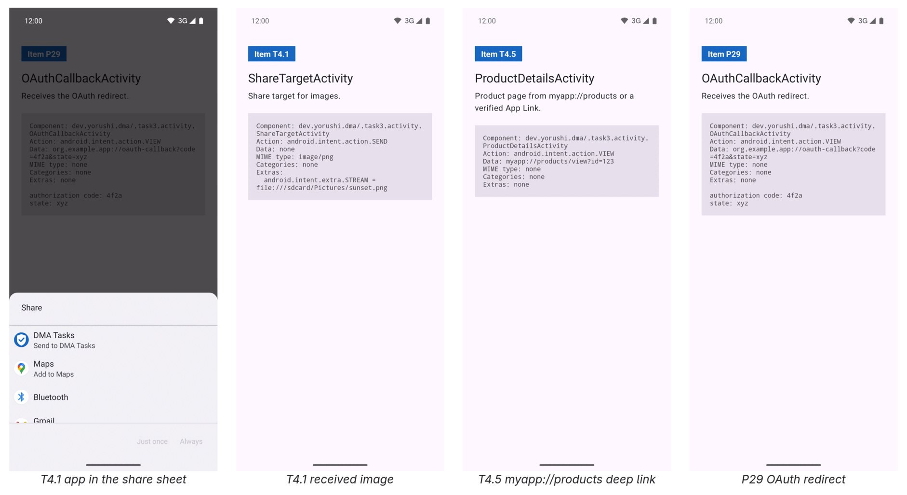
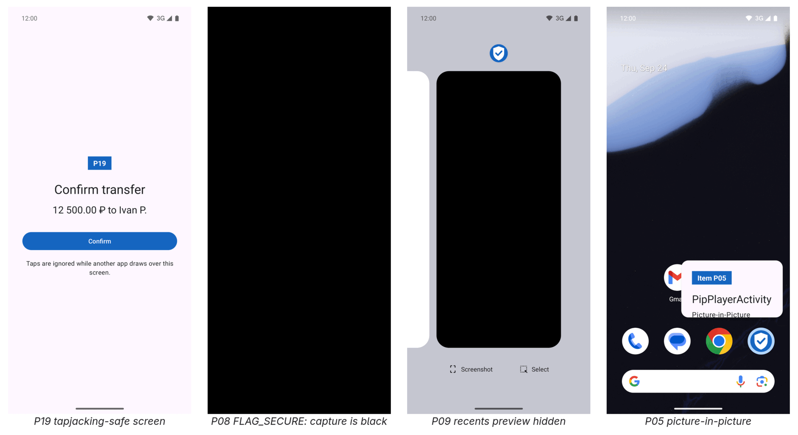
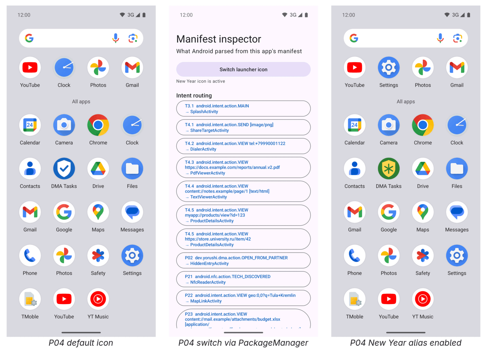

# DMA-2026 — Practical work 3: AndroidManifest.xml

Semyon Butuzov (yorushi), group P24-3.2 · assignment: [`task_3.md`](https://github.com/U5er01Task/DMA-2026/blob/main/task_3.md)

All **85 items** are implemented in one working Android app (`:app`): the **35 theme
exercises** (themes 1–7, five each) and the **50 practical items**. The app's
[`AndroidManifest.xml`](../../app/src/main/AndroidManifest.xml) is the production manifest of
P50, and every item in it is tagged with its id (`T4.3:`, `P19:`), so any item can be found by
searching for its number. The app is not just a manifest that compiles: each declaration is
backed by a real component, and an instrumented test reads it back from the installed package.

| | |
|---|---|
| Items implemented | 85 / 85 |
| Instrumented tests | 75, all passing on an Android 15 emulator |
| Build checks | [`verify.sh`](verify.sh): merged manifests of 3 APKs, `aapt2`, security audit |
| Toolchain | AGP 8.7.3, Gradle 8.11.1, JDK 21, compileSdk/targetSdk 35, minSdk 26 |
| Variants | `mobileDebug`, `mobileRelease`, `wearDebug` |

## Running it

```bash
cd dma-tasks
./gradlew assembleMobileDebug assembleMobileRelease assembleWearDebug
docs/task3/verify.sh                          # checks the three merged manifests
./gradlew connectedMobileDebugAndroidTest     # 75 tests, needs a device or emulator
./gradlew installMobileDebug                  # then open "DMA Tasks" from the launcher
```

The launcher opens the **manifest inspector**: one button per intent filter showing which
component Android resolved it to (tap to open it), buttons for the internal screens, the P04
icon switch, and a report of everything `PackageManager` parsed from the installed manifest.

## Screenshots

All captures are real: terminal output was recorded and rendered to images unchanged, and the
phone screens were taken with `adb exec-out screencap` on an Android 15 (API 35) emulator with
the demo-mode status bar.

**Compilation** — clean build of all three variants, `javac -Xlint:all`: no compiler or
manifest-merger warnings. The single `Warning:` line comes from the SDK tooling, not the
project: packages installed by the current `sdkmanager` declare XML schema v4, which the SDK
reader inside AGP does not know yet (AGP 8.13 prints it too).



**Merged-manifest checks** — [`verify.sh`](verify.sh) inspects the built APKs with `apkanalyzer`
and `aapt2`, links the minimal manifest (T1.5) and runs the security audit (P20):



**Instrumented tests** — through Gradle, then directly with `am instrument`, which also shows
the custom runner of P10 registered by the `<instrumentation>` tag:



<details>
<summary><b>Test report</b> (75 tests, every item by name)</summary>



</details>

**The app working:**









## Project layout

```
dma-tasks/
├── app/
│   ├── build.gradle.kts                 flavors, placeholders, per-flavor resources
│   └── src/
│       ├── main/AndroidManifest.xml     the production manifest (P50), every item tagged
│       ├── main/java/dev/yorushi/dma/
│       │   ├── MainApplication.java     T2.3, T7.1, T7.4, T7.5, P35
│       │   └── task3/
│       │       ├── activity/            25 screens; most echo the intent that opened them
│       │       ├── service/, receiver/, provider/, sync/, work/
│       │       ├── IntentCatalog.java   one probe intent per intent filter
│       │       └── ManifestReport.java  renders what PackageManager parsed
│       ├── main/res/xml/                network security, backup, shortcuts, filters…
│       ├── main/res/values-ru/          Russian translation (T2.4, T7.2)
│       ├── release/AndroidManifest.xml  overlay: debuggable forced to false (P15)
│       ├── wear/AndroidManifest.xml     overlay: Wear OS declarations (P42)
│       └── androidTest/                 <instrumentation> (P10), CustomTestRunner, ManifestTest
├── legacy-analytics/                    stub library with an outdated manifest
└── docs/task3/
    ├── minimal/AndroidManifest.xml      T1.5
    ├── p20-vulnerable/, p20-fixed/      P20: audited fragment and its fix
    ├── audit_exported.py                P20: exported-component audit
    └── verify.sh                        build-output checks
```

## Design notes

- **Tests read the installed package, not the XML.** `ManifestTest` asks `PackageManager` what
  it parsed, resolves every intent filter, launches screens and checks behaviour where the
  platform exposes it: the provider really refuses to grant a URI outside `/shared_docs/`
  (P14), the transaction screen really filters obscured touches (P19), the player really
  enters picture-in-picture (P05), the master-password window really has `FLAG_SECURE` (P09).
- **Merge directives resolve real conflicts.** A directive with nothing to override is a
  merger warning and proves nothing, so the `:legacy-analytics` stub library brings an
  outdated manifest: it requests `READ_PHONE_STATE`, sets `allowBackup="true"` and
  `debuggable="true"`, and declares minSdk 28 against the app's 26. The app's `tools:node`
  (T1.2), `tools:replace` (T1.3), `tools:overrideLibrary` (P01) and release overlay (P15) each
  win a real conflict. Checked by removing them one at a time: without `overrideLibrary` the
  build fails with *"minSdkVersion 26 cannot be smaller than version 28 declared in library
  [:legacy-analytics]"*; without the release overlay the release APK is `debuggable=true`.
- **Variant-specific parts live in overlays.** A watch build must be a separate APK (declaring
  `type.watch` in the phone build would hide it from phones on Google Play), so the `wear`
  flavor overlays only the watch declarations. `${applicationId}` placeholders keep
  authorities and permission names unique per flavor; XML resources cannot use placeholders,
  so the sync adapter's values are generated per flavor with `resValue`.
- **Internal screens are not exported.** Only launcher, deep-link and system-bound components
  are exported. `adb shell am start` on an internal screen fails with *"Permission Denial …
  not exported"*, so the emulator screenshots of those screens were taken by tapping through
  the inspector.
- **Edge-to-edge.** With targetSdk 35, Android 15 draws every window edge to edge; the theme
  has no action bar and each layout root pads itself for the system bars.

## Answers to the explanation items

**T1.4 — `sharedUserId`.** Deprecated since API 29: a shared UID can never be removed from an
installed app without losing its data, and it merges the permissions of every app sharing it.
The manifest adds `android:sharedUserMaxSdkVersion="32"`, so installs on Android 13+ ignore
the shared UID while devices that already relied on it keep it. The test confirms that on
Android 15 `PackageInfo.sharedUserId` is `null`.

**T1.5 — minimal manifest.** [`minimal/AndroidManifest.xml`](minimal/AndroidManifest.xml):
only the root `<manifest>`, the `android` namespace and `package` are mandatory for `aapt2`.
It also declares `<uses-sdk>`: without it, `aapt2 dump badging` shows the app as targetSdk
below 4 and the platform silently adds the legacy implied permissions `WRITE_EXTERNAL_STORAGE`
and `READ_PHONE_STATE`. In a Gradle project both `package` and `uses-sdk` come from
`build.gradle.kts` instead.

**T2.5 — `largeHeap`.** It asks for a bigger heap, but a larger heap means longer GC pauses,
makes the process a preferred kill target, may grant nothing on low-RAM devices, and hides
leaks instead of fixing them. For an image editor the real fix is decoding bitmaps at display
size and keeping large buffers in native memory; `largeHeap` is a last resort.

**T4.5 — `autoVerify`.** At install time Android downloads
`https://store.university.ru/.well-known/assetlinks.json`. If that file lists this package
name and the SHA-256 of its signing certificate, links to the domain open in the app directly
instead of the "Open with" chooser. Without a valid file, Android 12+ opens such links in the
browser; the app gets them only if the user enables the domain under *Open by default*. The
custom `myapp://` scheme needs no verification, but any app may claim it.

**T5.5 — `SCHEDULE_EXACT_ALARM`.** Google Play accepts it only for apps whose core function
needs exact timing (alarm clocks, calendars, timers); any other app is rejected at review and
must use inexact alarms or WorkManager. Since Android 14 the permission is denied by default
for new installs and the user grants it on a settings page.

**P09 — Recents preview.** `excludeFromRecents` only acts when the activity is the root of its
task. Opened from inside the app, the master-password screen joins the app's task, and that
task stays in Recents — the screenshot above shows it. What keeps the content private is the
window: `FLAG_SECURE` blanks the Recents thumbnail and blocks screenshots and casting
(`screencap` of that screen is solid black), and on Android 13+
`setRecentsScreenshotEnabled(false)` stops the thumbnail from being taken at all. The manifest
decides whether the task is listed; only the window flags protect what is shown.

**P37 — battery optimisations.** `REQUEST_IGNORE_BATTERY_OPTIMIZATIONS` lets the app show the
system dialog that exempts it from Doze. Google Play allows it only for a short list of use
cases (companion devices, VoIP, and similar); other apps using it are removed from the store.
The alternatives are high-priority FCM messages and WorkManager.

**P20 — manifest audit.** The audited fragment is
[`p20-vulnerable/AndroidManifest.xml`](p20-vulnerable/AndroidManifest.xml). AndroBugs
Framework is a Python 2 tool unmaintained since 2015, so [`audit_exported.py`](audit_exported.py)
performs the same check on the compiled binary manifest (`aapt2 dump xmltree`). It finds the
three critical issues:

| # | Component | Vulnerability | Fix in [`p20-fixed`](p20-fixed/AndroidManifest.xml) |
|---|---|---|---|
| 1 | `AccountsProvider` exported without permissions, `grantUriPermissions="true"` | Any installed app can query and modify every account row, and the app can be tricked into granting any URI | `signature` read and write permissions; grants limited to `/statements/` |
| 2 | `TransferReceiver` exported without permission, custom action | Any app can broadcast a forged `TRANSFER` intent | `android:permission` with a `signature` permission |
| 3 | `ChangePinActivity` exported, no intent filter | An internal screen can be started directly, bypassing the login flow | `exported="false"` |

The fixed fragment audits clean. The same script on this app's release APK reports 0 critical
findings and lists 21 public entry points (launcher, deep links, system bindings) whose input
has to be validated.

## Deliberate interpretations

| Item | Decision |
|---|---|
| Theme 1 | The `package` attribute of the example is gone: since AGP 8 the namespace comes from `build.gradle.kts`. |
| T3.1 | The launcher screen is named `SplashActivity`. |
| T5.2 | The "backward compatibility directive" is in code: the permission is declared for every version, but `InspectorActivity` asks for it at runtime only on API 33+, since older systems allow notifications at install. |
| T6.5 | Gamepad support is declared optional, so the same APK installs on phones and TVs. |
| T7.5 | There is no manifest switch for 120 Hz. The meta-data entry is read by the app and applied to every window via `preferredDisplayModeId`. |
| P01 | The assignment's minSdk 24 vs 21 becomes 28 vs 26, because the app's minSdk is 26. |
| P10 | `<instrumentation>` belongs to the test APK, so it is declared in `src/androidTest/AndroidManifest.xml`. |
| P11 | `isolatedProcess` runs the service with no permissions of its own, which limits what injected code could do; it does not stop code loading as such. |
| P33 | `dataSync` has no manifest timeout attribute: Android 15 caps it at 6 hours per day and calls `Service.onTimeout`, which `UploadService` implements. |
| P41 | Aspect-ratio limits apply only to non-resizable activities, so the activity sets `resizeableActivity="false"`. |
| P45 | There is no `uses-feature` for a stylus; the closest filter is "jazzhand" multitouch, declared optional. |
| P46 | `<supports-screens>` filters by size, not density; small screens are excluded. Filtering by density would need `<compatible-screens>`, which Google Play discourages. |

## Item index

Generated from the item tags in the sources: *Declared in* links to the tagged line,
*Verified by* to the instrumented test or to the `verify.sh` check.

### Theme exercises (35)

| Item | What | Declared in | Verified by |
|---|---|---|---|
| T1.1 | `xmlns:tools` for merge directives | [`AndroidManifest.xml:15`](../../app/src/main/AndroidManifest.xml#L15) | [`verify.sh`](verify.sh) (merge succeeds) |
| T1.2 | `tools:node="remove"` drops a library permission | [`AndroidManifest.xml:33`](../../app/src/main/AndroidManifest.xml#L33) | [`T1_2_mergerRemovedReadPhoneState`](../../app/src/androidTest/java/dev/yorushi/dma/ManifestTest.java#L108) |
| T1.3 | `tools:replace` forces `allowBackup` | [`AndroidManifest.xml:218`](../../app/src/main/AndroidManifest.xml#L218) | [`T1_3_T2_1_backupIsDisabled`](../../app/src/androidTest/java/dev/yorushi/dma/ManifestTest.java#L113) |
| T1.4 | `sharedUserId` with its deprecation limit | [`AndroidManifest.xml:17`](../../app/src/main/AndroidManifest.xml#L17) | [`T1_4_sharedUserIdIgnoredFromApi33`](../../app/src/androidTest/java/dev/yorushi/dma/ManifestTest.java#L118) |
| T1.5 | Minimal manifest accepted by `aapt2` | [`AndroidManifest.xml:2`](../../docs/task3/minimal/AndroidManifest.xml#L2) | [`verify.sh`](verify.sh) (aapt2 link) |
| T2.1 | Backup and `adb backup` disabled | [`AndroidManifest.xml:219`](../../app/src/main/AndroidManifest.xml#L219) | [`T1_3_T2_1_backupIsDisabled`](../../app/src/androidTest/java/dev/yorushi/dma/ManifestTest.java#L113) |
| T2.2 | Network security config with certificate pinning | [`AndroidManifest.xml:223`](../../app/src/main/AndroidManifest.xml#L223) | [`T2_2_P12_cleartextOnlyForLocalDevServer`](../../app/src/androidTest/java/dev/yorushi/dma/ManifestTest.java#L126) |
| T2.3 | Custom `Application` class | [`AndroidManifest.xml:225`](../../app/src/main/AndroidManifest.xml#L225) | [`T2_3_customApplicationClassIsUsed`](../../app/src/androidTest/java/dev/yorushi/dma/ManifestTest.java#L135) |
| T2.4 | Label from string resources (localised) | [`AndroidManifest.xml:226`](../../app/src/main/AndroidManifest.xml#L226) | [`T2_4_labelIsAStringResource`](../../app/src/androidTest/java/dev/yorushi/dma/ManifestTest.java#L141) |
| T2.5 | `largeHeap` and its risks | [`AndroidManifest.xml:229`](../../app/src/main/AndroidManifest.xml#L229) | [`T2_5_largeHeapRequested`](../../app/src/androidTest/java/dev/yorushi/dma/ManifestTest.java#L146) |
| T3.1 | Splash screen as the only launcher entry | [`AndroidManifest.xml:305`](../../app/src/main/AndroidManifest.xml#L305) | [`T3_1_splashIsTheOnlyLauncherEntry`](../../app/src/androidTest/java/dev/yorushi/dma/ManifestTest.java#L153) |
| T3.2 | Private database sync service | [`AndroidManifest.xml:668`](../../app/src/main/AndroidManifest.xml#L668) | [`T3_2_databaseSyncServiceIsPrivate`](../../app/src/androidTest/java/dev/yorushi/dma/ManifestTest.java#L162) |
| T3.3 | Game activity handles rotation itself | [`AndroidManifest.xml:386`](../../app/src/main/AndroidManifest.xml#L386) | [`T3_3_gameHandlesRotationItself`](../../app/src/androidTest/java/dev/yorushi/dma/ManifestTest.java#L167) |
| T3.4 | `IncomingCallActivity` in `singleInstance` | [`AndroidManifest.xml:393`](../../app/src/main/AndroidManifest.xml#L393) | [`T3_4_incomingCallIsSingleInstance`](../../app/src/androidTest/java/dev/yorushi/dma/ManifestTest.java#L174) |
| T3.5 | `FileProvider` for camera photos | [`AndroidManifest.xml:813`](../../app/src/main/AndroidManifest.xml#L813) | [`T3_5_fileProviderIsPrivateAndIssuesContentUris`](../../app/src/androidTest/java/dev/yorushi/dma/ManifestTest.java#L179) |
| T4.1 | Share target for images | [`AndroidManifest.xml:415`](../../app/src/main/AndroidManifest.xml#L415) | [`T4_1_shareTargetReceivesImages`](../../app/src/androidTest/java/dev/yorushi/dma/ManifestTest.java#L195) |
| T4.2 | `tel:` links | [`AndroidManifest.xml:428`](../../app/src/main/AndroidManifest.xml#L428) | [`T4_2_telLinksOpenDialer`](../../app/src/androidTest/java/dev/yorushi/dma/ManifestTest.java#L200) |
| T4.3 | PDF `pathPattern` | [`AndroidManifest.xml:441`](../../app/src/main/AndroidManifest.xml#L441) | [`T4_3_pdfPathPatternMatchesEvenWithExtraDots`](../../app/src/androidTest/java/dev/yorushi/dma/ManifestTest.java#L205) |
| T4.4 | `text/plain` and `text/html` | [`AndroidManifest.xml:466`](../../app/src/main/AndroidManifest.xml#L466) | [`T4_4_textAndHtmlAccepted`](../../app/src/androidTest/java/dev/yorushi/dma/ManifestTest.java#L215) |
| T4.5 | `autoVerify` App Link and `assetlinks.json` | [`AndroidManifest.xml:479`](../../app/src/main/AndroidManifest.xml#L479) | [`T4_5_customSchemeAndAppLinkRouteToProduct`](../../app/src/androidTest/java/dev/yorushi/dma/ManifestTest.java#L220) |
| T5.1 | Foreground and background location | [`AndroidManifest.xml:44`](../../app/src/main/AndroidManifest.xml#L44) | [`T5_1_locationPermissionsForBackgroundTracking`](../../app/src/androidTest/java/dev/yorushi/dma/ManifestTest.java#L227) |
| T5.2 | `POST_NOTIFICATIONS` with backward compatibility | [`AndroidManifest.xml:50`](../../app/src/main/AndroidManifest.xml#L50) | [`T5_2_notificationsPermissionRequested`](../../app/src/androidTest/java/dev/yorushi/dma/ManifestTest.java#L234) |
| T5.3 | Custom `signature` permission | [`AndroidManifest.xml:103`](../../app/src/main/AndroidManifest.xml#L103) | [`T5_3_signaturePermissionGuardsProtectedService`](../../app/src/androidTest/java/dev/yorushi/dma/ManifestTest.java#L239) |
| T5.4 | `WRITE_EXTERNAL_STORAGE` up to API 28 | [`AndroidManifest.xml:55`](../../app/src/main/AndroidManifest.xml#L55) | [`T5_4_writeStorageOnlyUpToApi28`](../../app/src/androidTest/java/dev/yorushi/dma/ManifestTest.java#L246) |
| T5.5 | `SCHEDULE_EXACT_ALARM` and the Play policy | [`AndroidManifest.xml:61`](../../app/src/main/AndroidManifest.xml#L61) | [`T5_5_exactAlarmPermissionRequested`](../../app/src/androidTest/java/dev/yorushi/dma/ManifestTest.java#L252) |
| T6.1 | Optional fingerprint sensor | [`AndroidManifest.xml:129`](../../app/src/main/AndroidManifest.xml#L129) | [`T6_1_fingerprintIsOptional`](../../app/src/androidTest/java/dev/yorushi/dma/ManifestTest.java#L259) |
| T6.2 | Required NFC | [`AndroidManifest.xml:135`](../../app/src/main/AndroidManifest.xml#L135) | [`T6_2_nfcIsRequired`](../../app/src/androidTest/java/dev/yorushi/dma/ManifestTest.java#L264) |
| T6.3 | `<queries>` for Yandex Maps and 2GIS | [`AndroidManifest.xml:200`](../../app/src/main/AndroidManifest.xml#L200) | [`verify.sh`](verify.sh) (read back from APK) |
| T6.4 | Optional telephony | [`AndroidManifest.xml:141`](../../app/src/main/AndroidManifest.xml#L141) | [`T6_4_telephonyIsOptional`](../../app/src/androidTest/java/dev/yorushi/dma/ManifestTest.java#L269) |
| T6.5 | Gamepad support for TV | [`AndroidManifest.xml:146`](../../app/src/main/AndroidManifest.xml#L146) | [`T6_5_gamepadIsOptional`](../../app/src/androidTest/java/dev/yorushi/dma/ManifestTest.java#L274) |
| T7.1 | Yandex MapKit key in meta-data | [`AndroidManifest.xml:251`](../../app/src/main/AndroidManifest.xml#L251) | [`T7_1_mapKitKeyInjectedFromBuildScript`](../../app/src/androidTest/java/dev/yorushi/dma/ManifestTest.java#L281) |
| T7.2 | `LocaleConfig` for per-app language | [`AndroidManifest.xml:227`](../../app/src/main/AndroidManifest.xml#L227) | [`T7_2_localeConfigOffersEnglishAndRussian`](../../app/src/androidTest/java/dev/yorushi/dma/ManifestTest.java#L288) |
| T7.3 | `android.app.searchable` on one activity | [`AndroidManifest.xml:572`](../../app/src/main/AndroidManifest.xml#L572) | [`T7_3_searchableBoundToSearchActivityOnly`](../../app/src/androidTest/java/dev/yorushi/dma/ManifestTest.java#L297) |
| T7.4 | `androidx.startup` initializer disabled | [`AndroidManifest.xml:295`](../../app/src/main/AndroidManifest.xml#L295) | [`T7_4_P35_startupInitializersReplacedByManualInit`](../../app/src/androidTest/java/dev/yorushi/dma/ManifestTest.java#L304) |
| T7.5 | 120 Hz refresh rate | [`AndroidManifest.xml:258`](../../app/src/main/AndroidManifest.xml#L258) | [`T7_5_refreshRateRequestedInManifest`](../../app/src/androidTest/java/dev/yorushi/dma/ManifestTest.java#L314) |

### Practical items (50)

| Item | What | Declared in | Verified by |
|---|---|---|---|
| P01 | `tools:overrideLibrary` for a higher library minSdk | [`AndroidManifest.xml:27`](../../app/src/main/AndroidManifest.xml#L27) | [`P01_libraryMinSdkOverridden`](../../app/src/androidTest/java/dev/yorushi/dma/ManifestTest.java#L321) |
| P02 | Entry reachable only from another app | [`AndroidManifest.xml:355`](../../app/src/main/AndroidManifest.xml#L355) | [`P02_partnerActionReachesHiddenScreen`](../../app/src/androidTest/java/dev/yorushi/dma/ManifestTest.java#L326) |
| P03 | Android 12+ splash screen theme | [`AndroidManifest.xml:306`](../../app/src/main/AndroidManifest.xml#L306) | [`P03_splashUsesSplashScreenTheme`](../../app/src/androidTest/java/dev/yorushi/dma/ManifestTest.java#L331) |
| P04 | `activity-alias` for a New Year icon | [`AndroidManifest.xml:324`](../../app/src/main/AndroidManifest.xml#L324) | [`P04_newYearAliasDisabledByDefault`](../../app/src/androidTest/java/dev/yorushi/dma/ManifestTest.java#L336) |
| P05 | Picture-in-picture | [`AndroidManifest.xml:366`](../../app/src/main/AndroidManifest.xml#L366) | [`P05_playerEntersPictureInPicture`](../../app/src/androidTest/java/dev/yorushi/dma/ManifestTest.java#L343) |
| P06 | Minimum multi-window size | [`AndroidManifest.xml:341`](../../app/src/main/AndroidManifest.xml#L341) | [`P06_minimumWindowSizeIs300x450dp`](../../app/src/androidTest/java/dev/yorushi/dma/ManifestTest.java#L354) |
| P07 | Audio service in `:playback_process` | [`AndroidManifest.xml:679`](../../app/src/main/AndroidManifest.xml#L679) | [`P07_playbackRunsInSeparateProcess`](../../app/src/androidTest/java/dev/yorushi/dma/ManifestTest.java#L362) |
| P08 | Master password excluded from Recents | [`AndroidManifest.xml:376`](../../app/src/main/AndroidManifest.xml#L376) | [`P08_masterPasswordExcludedFromRecents`](../../app/src/androidTest/java/dev/yorushi/dma/ManifestTest.java#L368) |
| P09 | Recents preview and `FLAG_SECURE` | [`AndroidManifest.xml:377`](../../app/src/main/AndroidManifest.xml#L377) | [`P09_masterPasswordWindowIsSecure`](../../app/src/androidTest/java/dev/yorushi/dma/ManifestTest.java#L373) |
| P10 | Custom instrumentation runner | [`AndroidManifest.xml:4`](../../app/src/androidTest/AndroidManifest.xml#L4) | [`P10_testsRunUnderTheCustomRunner`](../../app/src/androidTest/java/dev/yorushi/dma/ManifestTest.java#L382) |
| P11 | `isolatedProcess` service | [`AndroidManifest.xml:688`](../../app/src/main/AndroidManifest.xml#L688) | [`P11_rendererRunsInIsolatedProcess`](../../app/src/androidTest/java/dev/yorushi/dma/ManifestTest.java#L389) |
| P12 | Cleartext only for `192.168.1.50` | [`AndroidManifest.xml:223`](../../app/src/main/AndroidManifest.xml#L223) | [`T2_2_P12_cleartextOnlyForLocalDevServer`](../../app/src/androidTest/java/dev/yorushi/dma/ManifestTest.java#L126) |
| P13 | Provider with separate read and write permissions | [`AndroidManifest.xml:111`](../../app/src/main/AndroidManifest.xml#L111) | [`P13_providerHasSeparateReadAndWritePermissions`](../../app/src/androidTest/java/dev/yorushi/dma/ManifestTest.java#L394) |
| P14 | `grant-uri-permission` for `/shared_docs/` | [`AndroidManifest.xml:826`](../../app/src/main/AndroidManifest.xml#L826) | [`P14_onlySharedDocsCanBeGranted`](../../app/src/androidTest/java/dev/yorushi/dma/ManifestTest.java#L402) |
| P15 | `debuggable="false"` forced in release | [`AndroidManifest.xml:6`](../../app/src/release/AndroidManifest.xml#L6) | [`verify.sh`](verify.sh) (release APK) |
| P16 | Receiver behind a `signature` permission | [`AndroidManifest.xml:121`](../../app/src/main/AndroidManifest.xml#L121) | [`P16_syncReceiverGuardedBySignaturePermission`](../../app/src/androidTest/java/dev/yorushi/dma/ManifestTest.java#L423) |
| P17 | Activity gated by `BIND_ACCESSIBILITY_SERVICE` | [`AndroidManifest.xml:402`](../../app/src/main/AndroidManifest.xml#L402) | [`P17_screenRequiresAccessibilityBindPermission`](../../app/src/androidTest/java/dev/yorushi/dma/ManifestTest.java#L433) |
| P18 | Backup rules for both backup APIs | [`AndroidManifest.xml:221`](../../app/src/main/AndroidManifest.xml#L221) | [`verify.sh`](verify.sh) (read back from APK) |
| P19 | Tapjacking protection | [`AndroidManifest.xml:91`](../../app/src/main/AndroidManifest.xml#L91) | [`P19_transactionScreenFiltersObscuredTouches`](../../app/src/androidTest/java/dev/yorushi/dma/ManifestTest.java#L439) |
| P20 | Audit of exported components | [`AndroidManifest.xml:2`](../../docs/task3/p20-vulnerable/AndroidManifest.xml#L2) | [`verify.sh`](verify.sh) (audit script) |
| P21 | NFC `TECH_DISCOVERED` for Mifare | [`AndroidManifest.xml:506`](../../app/src/main/AndroidManifest.xml#L506) | [`P21_nfcTechDiscoveredRoutesToReader`](../../app/src/androidTest/java/dev/yorushi/dma/ManifestTest.java#L453) |
| P22 | `geo:` links | [`AndroidManifest.xml:519`](../../app/src/main/AndroidManifest.xml#L519) | [`P22_geoLinksOpenMap`](../../app/src/androidTest/java/dev/yorushi/dma/ManifestTest.java#L458) |
| P23 | `.docx` and `.xlsx` attachments | [`AndroidManifest.xml:531`](../../app/src/main/AndroidManifest.xml#L531) | [`P23_officeAttachmentsOpen`](../../app/src/androidTest/java/dev/yorushi/dma/ManifestTest.java#L463) |
| P24 | App shortcuts | [`AndroidManifest.xml:318`](../../app/src/main/AndroidManifest.xml#L318) | [`P24_shortcutsDeclaredOnLauncherActivity`](../../app/src/androidTest/java/dev/yorushi/dma/ManifestTest.java#L468) |
| P25 | Marketplace App Link | [`AndroidManifest.xml:554`](../../app/src/main/AndroidManifest.xml#L554) | [`P25_marketplaceAppLinkRoutes`](../../app/src/androidTest/java/dev/yorushi/dma/ManifestTest.java#L473) |
| P26 | Headset `MEDIA_BUTTON` | [`AndroidManifest.xml:795`](../../app/src/main/AndroidManifest.xml#L795) | [`P26_mediaButtonReceiverRegistered`](../../app/src/androidTest/java/dev/yorushi/dma/ManifestTest.java#L478) |
| P27 | System search action | [`AndroidManifest.xml:571`](../../app/src/main/AndroidManifest.xml#L571) | [`P27_searchActionRoutes`](../../app/src/androidTest/java/dev/yorushi/dma/ManifestTest.java#L483) |
| P28 | `smsto:` composer | [`AndroidManifest.xml:585`](../../app/src/main/AndroidManifest.xml#L585) | [`P28_smstoOpensComposer`](../../app/src/androidTest/java/dev/yorushi/dma/ManifestTest.java#L488) |
| P29 | OAuth redirect | [`AndroidManifest.xml:599`](../../app/src/main/AndroidManifest.xml#L599) | [`P29_oauthRedirectRoutes`](../../app/src/androidTest/java/dev/yorushi/dma/ManifestTest.java#L493) |
| P30 | `.mycfg` files | [`AndroidManifest.xml:615`](../../app/src/main/AndroidManifest.xml#L615) | [`P30_mycfgFilesOpen`](../../app/src/androidTest/java/dev/yorushi/dma/ManifestTest.java#L498) |
| P31 | Microphone foreground service | [`AndroidManifest.xml:696`](../../app/src/main/AndroidManifest.xml#L696) | [`P31_voiceNotesAreMicrophoneService`](../../app/src/androidTest/java/dev/yorushi/dma/ManifestTest.java#L505) |
| P32 | Location foreground service | [`AndroidManifest.xml:702`](../../app/src/main/AndroidManifest.xml#L702) | [`P32_courierIsLocationService`](../../app/src/androidTest/java/dev/yorushi/dma/ManifestTest.java#L511) |
| P33 | `dataSync` service and its timeout | [`AndroidManifest.xml:708`](../../app/src/main/AndroidManifest.xml#L708) | [`P33_uploadIsDataSyncService`](../../app/src/androidTest/java/dev/yorushi/dma/ManifestTest.java#L517) |
| P34 | `mediaProjection` service | [`AndroidManifest.xml:716`](../../app/src/main/AndroidManifest.xml#L716) | [`P34_castIsMediaProjectionService`](../../app/src/androidTest/java/dev/yorushi/dma/ManifestTest.java#L523) |
| P35 | WorkManager without auto-initialisation | [`AndroidManifest.xml:289`](../../app/src/main/AndroidManifest.xml#L289) | [`T7_4_P35_startupInitializersReplacedByManualInit`](../../app/src/androidTest/java/dev/yorushi/dma/ManifestTest.java#L304) |
| P36 | Start after reboot | [`AndroidManifest.xml:82`](../../app/src/main/AndroidManifest.xml#L82) | [`P36_bootReceiverRegistered`](../../app/src/androidTest/java/dev/yorushi/dma/ManifestTest.java#L529) |
| P37 | Battery optimisation exemption and its Play risk | [`AndroidManifest.xml:85`](../../app/src/main/AndroidManifest.xml#L85) | [`P37_batteryOptimisationPermissionRequested`](../../app/src/androidTest/java/dev/yorushi/dma/ManifestTest.java#L535) |
| P38 | Accessibility service | [`AndroidManifest.xml:722`](../../app/src/main/AndroidManifest.xml#L722) | [`P38_accessibilityServiceDeclared`](../../app/src/androidTest/java/dev/yorushi/dma/ManifestTest.java#L540) |
| P39 | Sync adapter | [`AndroidManifest.xml:737`](../../app/src/main/AndroidManifest.xml#L737) | [`P39_syncAdapterAndAuthenticatorDeclared`](../../app/src/androidTest/java/dev/yorushi/dma/ManifestTest.java#L547) |
| P40 | Live wallpaper | [`AndroidManifest.xml:760`](../../app/src/main/AndroidManifest.xml#L760) | [`P40_liveWallpaperDeclared`](../../app/src/androidTest/java/dev/yorushi/dma/ManifestTest.java#L553) |
| P41 | Aspect-ratio limits for foldables | [`AndroidManifest.xml:632`](../../app/src/main/AndroidManifest.xml#L632) | [`verify.sh`](verify.sh) (read back from APK) |
| P42 | Wear OS build | [`AndroidManifest.xml:5`](../../app/src/wear/AndroidManifest.xml#L5) | [`verify.sh`](verify.sh) (wear APK) |
| P43 | Android Auto | [`AndroidManifest.xml:265`](../../app/src/main/AndroidManifest.xml#L265) | [`P43_androidAutoDescriptorAndMediaService`](../../app/src/androidTest/java/dev/yorushi/dma/ManifestTest.java#L561) |
| P44 | Android TV launcher | [`AndroidManifest.xml:151`](../../app/src/main/AndroidManifest.xml#L151) | [`P44_tvLauncherEntryWithoutTouchscreen`](../../app/src/androidTest/java/dev/yorushi/dma/ManifestTest.java#L567) |
| P45 | Stylus-class multitouch | [`AndroidManifest.xml:160`](../../app/src/main/AndroidManifest.xml#L160) | [`P45_advancedMultitouchIsOptional`](../../app/src/androidTest/java/dev/yorushi/dma/ManifestTest.java#L574) |
| P46 | No small screens | [`AndroidManifest.xml:190`](../../app/src/main/AndroidManifest.xml#L190) | [`P46_smallScreensExcluded`](../../app/src/androidTest/java/dev/yorushi/dma/ManifestTest.java#L579) |
| P47 | `HIGH_SAMPLING_RATE_SENSORS` | [`AndroidManifest.xml:95`](../../app/src/main/AndroidManifest.xml#L95) | [`P47_highSamplingRatePermissionRequested`](../../app/src/androidTest/java/dev/yorushi/dma/ManifestTest.java#L587) |
| P48 | Optional camera flash | [`AndroidManifest.xml:167`](../../app/src/main/AndroidManifest.xml#L167) | [`P48_flashIsOptional`](../../app/src/androidTest/java/dev/yorushi/dma/ManifestTest.java#L592) |
| P49 | USB device attach | [`AndroidManifest.xml:654`](../../app/src/main/AndroidManifest.xml#L654) | [`P49_usbAttachStartsTheApp`](../../app/src/androidTest/java/dev/yorushi/dma/ManifestTest.java#L597) |
| P50 | Complete production manifest | [`AndroidManifest.xml:6`](../../app/src/main/AndroidManifest.xml#L6) | [`P50_productionManifestHasAtLeastThreeDangerousPermissions`](../../app/src/androidTest/java/dev/yorushi/dma/ManifestTest.java#L602) |
