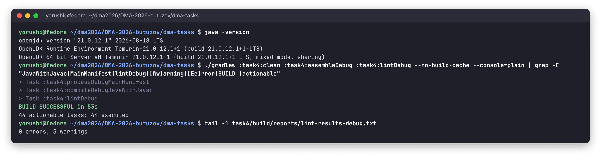
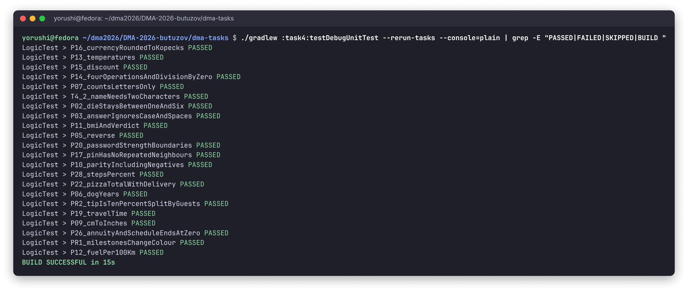
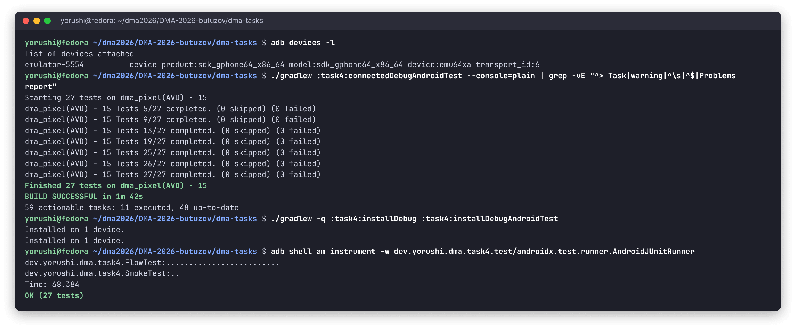
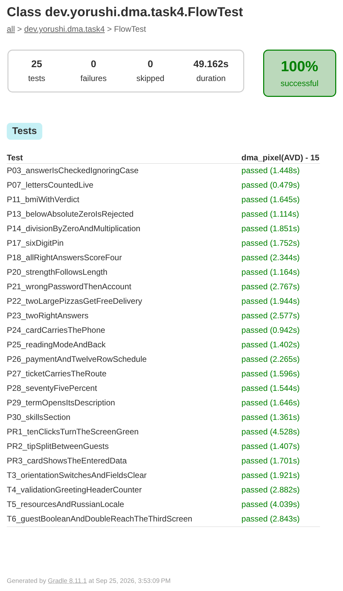
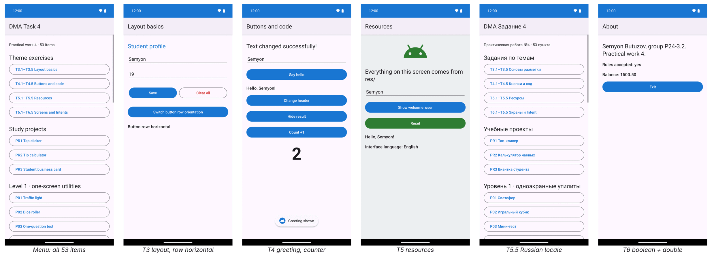
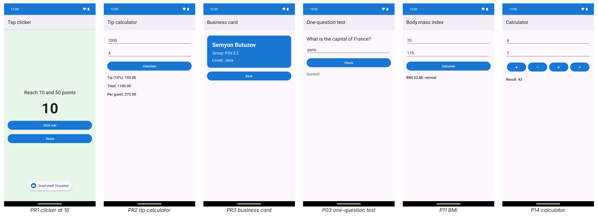
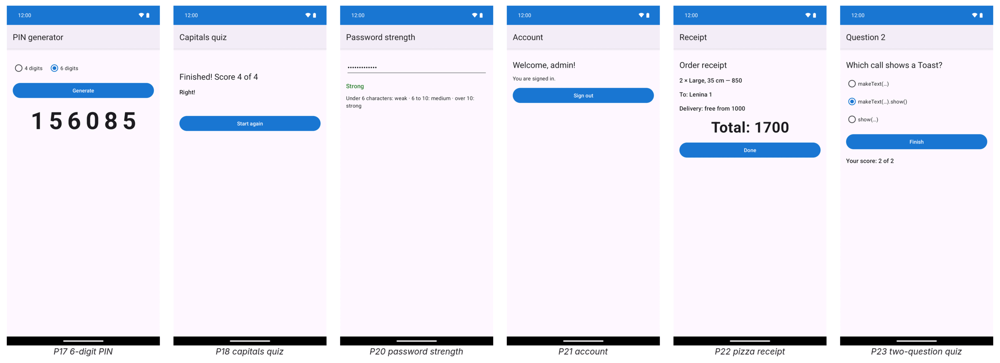
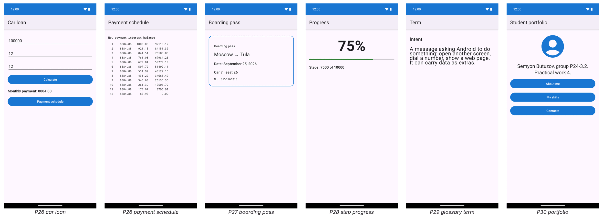

# DMA-2026 — Practical work 4: first Android apps in Java

Semyon Butuzov (yorushi), group P24-3.2 · assignment: [`task_4.md`](https://github.com/U5er01Task/DMA-2026/blob/main/task_4.md)

All **53 items** are implemented in one app, the `:task4` module (`dev.yorushi.dma.task4`):
the **20 theme exercises** (sections 3–6, five each), the **3 study projects** of section 7 and
the **30 practical items**. The app opens on a menu with a button for every item.

| | |
|---|---|
| Items implemented | 53 / 53 |
| Screens | 51 activities (menu, 37 item screens, 13 second screens) |
| Unit tests | 22, all logic of the calculators and rules (JUnit 4, JVM) |
| Instrumented tests | 27 on an Android 15 emulator: every screen opens, 25 user scenarios |
| Lint | 0 errors; hardcoded text in code or layouts is a build error |
| Languages | English, Russian (`values-ru`) |

## Running it

```bash
cd dma-tasks
./gradlew :task4:assembleDebug :task4:lintDebug   # build; lint fails on any hardcoded text
./gradlew :task4:testDebugUnitTest                # 22 unit tests, no device needed
./gradlew :task4:connectedDebugAndroidTest        # 27 instrumented tests, needs a device
./gradlew :task4:installDebug                     # then open "DMA Task 4"
```

## Screenshots

Terminal output was captured from real runs and rendered unchanged; the phone screens were
taken by the instrumented tests themselves (`Shots.take`) right after their assertions passed,
so each picture shows a checked state.

**Compilation** — clean build with `javac -Xlint:all` (no warnings) and lint. The `Warning:`
line comes from the SDK tooling, not from the project (see [task 3](../task3/README.md#screenshots)).



**Unit tests** — the logic behind the screens, run on the JVM:



**Instrumented tests** — through Gradle, then directly with `am instrument`:



<details>
<summary><b>Test report</b> (scenario tests by name)</summary>



</details>

**The app working:**









## Project layout

```
task4/src/
├── main/java/dev/yorushi/dma/task4/
│   ├── MainActivity.java, Catalog.java   the menu; Catalog lists every screen
│   ├── Ui.java                           safe number input (mistake no. 2 of section 8)
│   ├── logic/                            Calc, Texts, Randoms, Orders, Clicker: pure Java
│   ├── theme/                            themes 3–6
│   ├── project/                          the three study projects
│   └── practice/                         practical items 1–30
├── main/res/layout/                      one XML layout per screen
├── main/res/values/, values-ru/          strings in two languages, colours, styles
├── test/                                 LogicTest (JVM)
└── androidTest/                          SmokeTest, FlowTest, Shots
```

## Design notes

- **As the tutorial teaches.** Layouts are XML with `LinearLayout`, views are found with
  `findViewById`, clicks go through `setOnClickListener`, screens pass data through `Intent`
  extras and are declared in the manifest.
- **Logic separate from screens.** Every formula and rule lives in `logic/` as plain Java, so it
  is unit-tested without a device: BMI thresholds, annuity schedule, PIN rules, password
  strength, pizza pricing. The activities only read input, call it and show the result.
- **No crash on bad input.** `Ui` reads numbers from `EditText`: an empty field, a non-number, a
  negative or zero value is shown as an error on the field itself instead of crashing with
  `NumberFormatException` (the section's mistake no. 2). A comma is accepted as the decimal
  separator.
- **Theme 5 enforced.** Every visible text is a string resource; lint's `HardcodedText` and
  `SetTextI18n` are build errors, so a string typed into a layout or `setText("…")` fails the
  build.
- **Android 15.** The app targets API 35, which would draw the screens under the status bar;
  the tutorial's screens are laid out below an action bar, so the edge-to-edge enforcement is
  opted out of in the theme.

### Deliberate interpretations

| Item | Decision |
|---|---|
| T3.1 | Changing `orientation` is shown at runtime: a button switches the row between vertical and horizontal, instead of a second copy of the layout. |
| T3–T6 | Each section's five exercises modify the tutorial's one example screen, so each section is one screen with all five changes. |
| T5.5 | The default language is English and `values-ru` the alternative (the reverse of the exercise), in line with the other works; the test switches the app's per-app language to Russian. |
| T6.2, T6.4 | The flag and the balance are entered on the first screen and passed through the second to the third. |
| P07 | Counts letters (as the item says) and shows the total character count next to it. |
| P08 | "Maximum brightness" is the window's brightness override, restored when the light is off. |
| P16 | Fixed rates: 90 ₽/USD, 98 ₽/EUR. |
| P22 | Delivery costs 150 and is free from 1000; a quantity field was added. |
| P23 | The score of question 1 travels with the Intent; the total appears on the second screen. |
| P26 | Annuity payment; the last month absorbs rounding so the balance ends at exactly 0. |
| P27 | Car, seat and ticket number are random; the date is today's. |

## Item index

Generated from the sources: *Screen* links to the activity, *Verified by* to the instrumented
scenario (FlowTest), the unit test (LogicTest), or for three single-button screens to the
SmokeTest that opens every screen.

### Theme exercises (20)

| Item | What | Screen | Verified by |
|---|---|---|---|
| T3.1 | Row orientation, vertical ↔ horizontal | [`LayoutActivity`](../../task4/src/main/java/dev/yorushi/dma/task4/theme/LayoutActivity.java) | [`T3_orientationSwitchesAndFieldsClear`](../../task4/src/androidTest/java/dev/yorushi/dma/task4/FlowTest.java#L78) |
| T3.2 | Age field with `inputType="number"` | [`LayoutActivity`](../../task4/src/main/java/dev/yorushi/dma/task4/theme/LayoutActivity.java) | [`T3_orientationSwitchesAndFieldsClear`](../../task4/src/androidTest/java/dev/yorushi/dma/task4/FlowTest.java#L78) |
| T3.3 | Blue header, `textColor="#1976D2"` | [`LayoutActivity`](../../task4/src/main/java/dev/yorushi/dma/task4/theme/LayoutActivity.java) | [`T3_orientationSwitchesAndFieldsClear`](../../task4/src/androidTest/java/dev/yorushi/dma/task4/FlowTest.java#L78) |
| T3.4 | `layout_marginTop="20dp"` between elements | [`LayoutActivity`](../../task4/src/main/java/dev/yorushi/dma/task4/theme/LayoutActivity.java) | [`T3_orientationSwitchesAndFieldsClear`](../../task4/src/androidTest/java/dev/yorushi/dma/task4/FlowTest.java#L78) |
| T3.5 | Red "Clear all" button | [`LayoutActivity`](../../task4/src/main/java/dev/yorushi/dma/task4/theme/LayoutActivity.java) | [`T3_orientationSwitchesAndFieldsClear`](../../task4/src/androidTest/java/dev/yorushi/dma/task4/FlowTest.java#L78) |
| T4.1 | Toast after the greeting | [`GreetingActivity`](../../task4/src/main/java/dev/yorushi/dma/task4/theme/GreetingActivity.java) | [`T4_validationGreetingHeaderCounter`](../../task4/src/androidTest/java/dev/yorushi/dma/task4/FlowTest.java#L91) |
| T4.2 | "Name is too short" under 2 characters | [`GreetingActivity`](../../task4/src/main/java/dev/yorushi/dma/task4/theme/GreetingActivity.java) | [`T4_validationGreetingHeaderCounter`](../../task4/src/androidTest/java/dev/yorushi/dma/task4/FlowTest.java#L91) |
| T4.3 | Button changing the header | [`GreetingActivity`](../../task4/src/main/java/dev/yorushi/dma/task4/theme/GreetingActivity.java) | [`T4_validationGreetingHeaderCounter`](../../task4/src/androidTest/java/dev/yorushi/dma/task4/FlowTest.java#L91) |
| T4.4 | Result hidden with `View.GONE` | [`GreetingActivity`](../../task4/src/main/java/dev/yorushi/dma/task4/theme/GreetingActivity.java) | [`T4_validationGreetingHeaderCounter`](../../task4/src/androidTest/java/dev/yorushi/dma/task4/FlowTest.java#L91) |
| T4.5 | Click counter | [`GreetingActivity`](../../task4/src/main/java/dev/yorushi/dma/task4/theme/GreetingActivity.java) | [`T4_validationGreetingHeaderCounter`](../../task4/src/androidTest/java/dev/yorushi/dma/task4/FlowTest.java#L91) |
| T5.1 | No text in code or layouts (lint `HardcodedText` is an error) | [`ResourcesActivity`](../../task4/src/main/java/dev/yorushi/dma/task4/theme/ResourcesActivity.java) | [`T5_resourcesAndRussianLocale`](../../task4/src/androidTest/java/dev/yorushi/dma/task4/FlowTest.java#L109) |
| T5.2 | `brand_blue`, `brand_green`, `brand_gray` | [`ResourcesActivity`](../../task4/src/main/java/dev/yorushi/dma/task4/theme/ResourcesActivity.java) | [`T5_resourcesAndRussianLocale`](../../task4/src/androidTest/java/dev/yorushi/dma/task4/FlowTest.java#L109) |
| T5.3 | Material vector icon in an ImageView | [`ResourcesActivity`](../../task4/src/main/java/dev/yorushi/dma/task4/theme/ResourcesActivity.java) | [`T5_resourcesAndRussianLocale`](../../task4/src/androidTest/java/dev/yorushi/dma/task4/FlowTest.java#L109) |
| T5.4 | `welcome_user` with `%1$s` | [`ResourcesActivity`](../../task4/src/main/java/dev/yorushi/dma/task4/theme/ResourcesActivity.java) | [`T5_resourcesAndRussianLocale`](../../task4/src/androidTest/java/dev/yorushi/dma/task4/FlowTest.java#L109) |
| T5.5 | Second language (`values-ru`) | [`ResourcesActivity`](../../task4/src/main/java/dev/yorushi/dma/task4/theme/ResourcesActivity.java) | [`T5_resourcesAndRussianLocale`](../../task4/src/androidTest/java/dev/yorushi/dma/task4/FlowTest.java#L109) |
| T6.1 | Third screen with the author and Exit | [`AboutActivity`](../../task4/src/main/java/dev/yorushi/dma/task4/theme/AboutActivity.java) | [`T6_guestBooleanAndDoubleReachTheThirdScreen`](../../task4/src/androidTest/java/dev/yorushi/dma/task4/FlowTest.java#L136) |
| T6.2 | `boolean` passed to the third screen | [`IntentSecondActivity`](../../task4/src/main/java/dev/yorushi/dma/task4/theme/IntentSecondActivity.java) | [`T6_guestBooleanAndDoubleReachTheThirdScreen`](../../task4/src/androidTest/java/dev/yorushi/dma/task4/FlowTest.java#L136) |
| T6.3 | `null` name shown as "Guest" | [`IntentSecondActivity`](../../task4/src/main/java/dev/yorushi/dma/task4/theme/IntentSecondActivity.java) | [`T6_guestBooleanAndDoubleReachTheThirdScreen`](../../task4/src/androidTest/java/dev/yorushi/dma/task4/FlowTest.java#L136) |
| T6.4 | `double` passed along | [`IntentStartActivity`](../../task4/src/main/java/dev/yorushi/dma/task4/theme/IntentStartActivity.java) | [`T6_guestBooleanAndDoubleReachTheThirdScreen`](../../task4/src/androidTest/java/dev/yorushi/dma/task4/FlowTest.java#L136) |
| T6.5 | Browser via `ACTION_VIEW` | [`IntentSecondActivity`](../../task4/src/main/java/dev/yorushi/dma/task4/theme/IntentSecondActivity.java) | [`T6_guestBooleanAndDoubleReachTheThirdScreen`](../../task4/src/androidTest/java/dev/yorushi/dma/task4/FlowTest.java#L136) |

### Study projects (3)

| Item | What | Screen | Verified by |
|---|---|---|---|
| PR1 | Tap clicker | [`ClickerActivity`](../../task4/src/main/java/dev/yorushi/dma/task4/project/ClickerActivity.java) | [`PR1_tenClicksTurnTheScreenGreen`](../../task4/src/androidTest/java/dev/yorushi/dma/task4/FlowTest.java#L153)<br>[`PR1_milestonesChangeColour`](../../task4/src/test/java/dev/yorushi/dma/task4/logic/LogicTest.java#L27) |
| PR2 | Tip calculator | [`TipActivity`](../../task4/src/main/java/dev/yorushi/dma/task4/project/TipActivity.java) | [`PR2_tipSplitBetweenGuests`](../../task4/src/androidTest/java/dev/yorushi/dma/task4/FlowTest.java#L166)<br>[`PR2_tipIsTenPercentSplitByGuests`](../../task4/src/test/java/dev/yorushi/dma/task4/logic/LogicTest.java#L34) |
| PR3 | Student business card (2 screens) | [`CardFormActivity`](../../task4/src/main/java/dev/yorushi/dma/task4/project/CardFormActivity.java) | [`PR3_cardShowsTheEnteredData`](../../task4/src/androidTest/java/dev/yorushi/dma/task4/FlowTest.java#L178) |

### Practical items (30)

| Item | What | Screen | Verified by |
|---|---|---|---|
| P01 | Traffic light | [`TrafficLightActivity`](../../task4/src/main/java/dev/yorushi/dma/task4/practice/TrafficLightActivity.java) | [`SmokeTest`](../../task4/src/androidTest/java/dev/yorushi/dma/task4/SmokeTest.java) |
| P02 | Dice roller | [`DiceActivity`](../../task4/src/main/java/dev/yorushi/dma/task4/practice/DiceActivity.java) | [`P02_dieStaysBetweenOneAndSix`](../../task4/src/test/java/dev/yorushi/dma/task4/logic/LogicTest.java#L42) |
| P03 | One-question test | [`QuizOneActivity`](../../task4/src/main/java/dev/yorushi/dma/task4/practice/QuizOneActivity.java) | [`P03_answerIsCheckedIgnoringCase`](../../task4/src/androidTest/java/dev/yorushi/dma/task4/FlowTest.java#L193)<br>[`P03_answerIgnoresCaseAndSpaces`](../../task4/src/test/java/dev/yorushi/dma/task4/logic/LogicTest.java#L56) |
| P04 | Show / hide a secret | [`SecretToggleActivity`](../../task4/src/main/java/dev/yorushi/dma/task4/practice/SecretToggleActivity.java) | [`SmokeTest`](../../task4/src/androidTest/java/dev/yorushi/dma/task4/SmokeTest.java) |
| P05 | Text inverter | [`ReverseActivity`](../../task4/src/main/java/dev/yorushi/dma/task4/practice/ReverseActivity.java) | [`P05_reverse`](../../task4/src/test/java/dev/yorushi/dma/task4/logic/LogicTest.java#L62) |
| P06 | Dog age | [`DogAgeActivity`](../../task4/src/main/java/dev/yorushi/dma/task4/practice/DogAgeActivity.java) | [`P06_dogYears`](../../task4/src/test/java/dev/yorushi/dma/task4/logic/LogicTest.java#L67) |
| P07 | Letter counter, live | [`CharCountActivity`](../../task4/src/main/java/dev/yorushi/dma/task4/practice/CharCountActivity.java) | [`P07_lettersCountedLive`](../../task4/src/androidTest/java/dev/yorushi/dma/task4/FlowTest.java#L203)<br>[`P07_countsLettersOnly`](../../task4/src/test/java/dev/yorushi/dma/task4/logic/LogicTest.java#L72) |
| P08 | Flashlight at full brightness | [`FlashlightActivity`](../../task4/src/main/java/dev/yorushi/dma/task4/practice/FlashlightActivity.java) | [`SmokeTest`](../../task4/src/androidTest/java/dev/yorushi/dma/task4/SmokeTest.java) |
| P09 | Centimetres to inches | [`CmToInchActivity`](../../task4/src/main/java/dev/yorushi/dma/task4/practice/CmToInchActivity.java) | [`P09_cmToInches`](../../task4/src/test/java/dev/yorushi/dma/task4/logic/LogicTest.java#L77) |
| P10 | Even or odd | [`ParityActivity`](../../task4/src/main/java/dev/yorushi/dma/task4/practice/ParityActivity.java) | [`P10_parityIncludingNegatives`](../../task4/src/test/java/dev/yorushi/dma/task4/logic/LogicTest.java#L82) |
| P11 | Body mass index | [`BmiActivity`](../../task4/src/main/java/dev/yorushi/dma/task4/practice/BmiActivity.java) | [`P11_bmiWithVerdict`](../../task4/src/androidTest/java/dev/yorushi/dma/task4/FlowTest.java#L211)<br>[`P11_bmiAndVerdict`](../../task4/src/test/java/dev/yorushi/dma/task4/logic/LogicTest.java#L90) |
| P12 | Fuel consumption | [`FuelActivity`](../../task4/src/main/java/dev/yorushi/dma/task4/practice/FuelActivity.java) | [`P12_fuelPer100Km`](../../task4/src/test/java/dev/yorushi/dma/task4/logic/LogicTest.java#L98) |
| P13 | Celsius to Fahrenheit and Kelvin | [`TemperatureActivity`](../../task4/src/main/java/dev/yorushi/dma/task4/practice/TemperatureActivity.java) | [`P13_belowAbsoluteZeroIsRejected`](../../task4/src/androidTest/java/dev/yorushi/dma/task4/FlowTest.java#L222)<br>[`P13_temperatures`](../../task4/src/test/java/dev/yorushi/dma/task4/logic/LogicTest.java#L103) |
| P14 | Calculator, division by zero refused | [`CalculatorActivity`](../../task4/src/main/java/dev/yorushi/dma/task4/practice/CalculatorActivity.java) | [`P14_divisionByZeroAndMultiplication`](../../task4/src/androidTest/java/dev/yorushi/dma/task4/FlowTest.java#L234)<br>[`P14_fourOperationsAndDivisionByZero`](../../task4/src/test/java/dev/yorushi/dma/task4/logic/LogicTest.java#L109) |
| P15 | Shop discount | [`DiscountActivity`](../../task4/src/main/java/dev/yorushi/dma/task4/practice/DiscountActivity.java) | [`P15_discount`](../../task4/src/test/java/dev/yorushi/dma/task4/logic/LogicTest.java#L118) |
| P16 | Roubles to USD / EUR | [`CurrencyActivity`](../../task4/src/main/java/dev/yorushi/dma/task4/practice/CurrencyActivity.java) | [`P16_currencyRoundedToKopecks`](../../task4/src/test/java/dev/yorushi/dma/task4/logic/LogicTest.java#L125) |
| P17 | PIN without repeated neighbours | [`PinActivity`](../../task4/src/main/java/dev/yorushi/dma/task4/practice/PinActivity.java) | [`P17_sixDigitPin`](../../task4/src/androidTest/java/dev/yorushi/dma/task4/FlowTest.java#L249)<br>[`P17_pinHasNoRepeatedNeighbours`](../../task4/src/test/java/dev/yorushi/dma/task4/logic/LogicTest.java#L131) |
| P18 | Capitals quiz with score | [`CapitalsQuizActivity`](../../task4/src/main/java/dev/yorushi/dma/task4/practice/CapitalsQuizActivity.java) | [`P18_allRightAnswersScoreFour`](../../task4/src/androidTest/java/dev/yorushi/dma/task4/FlowTest.java#L259) |
| P19 | Travel time | [`TravelTimeActivity`](../../task4/src/main/java/dev/yorushi/dma/task4/practice/TravelTimeActivity.java) | [`P19_travelTime`](../../task4/src/test/java/dev/yorushi/dma/task4/logic/LogicTest.java#L143) |
| P20 | Password strength | [`PasswordActivity`](../../task4/src/main/java/dev/yorushi/dma/task4/practice/PasswordActivity.java) | [`P20_strengthFollowsLength`](../../task4/src/androidTest/java/dev/yorushi/dma/task4/FlowTest.java#L271)<br>[`P20_passwordStrengthBoundaries`](../../task4/src/test/java/dev/yorushi/dma/task4/logic/LogicTest.java#L150) |
| P21 | Login `admin`/`1234` → account | [`LoginActivity`](../../task4/src/main/java/dev/yorushi/dma/task4/practice/LoginActivity.java) | [`P21_wrongPasswordThenAccount`](../../task4/src/androidTest/java/dev/yorushi/dma/task4/FlowTest.java#L282) |
| P22 | Pizza order → receipt | [`PizzaActivity`](../../task4/src/main/java/dev/yorushi/dma/task4/practice/PizzaActivity.java) | [`P22_twoLargePizzasGetFreeDelivery`](../../task4/src/androidTest/java/dev/yorushi/dma/task4/FlowTest.java#L296)<br>[`P22_pizzaTotalWithDelivery`](../../task4/src/test/java/dev/yorushi/dma/task4/logic/LogicTest.java#L158) |
| P23 | Two-question quiz | [`QuizFirstActivity`](../../task4/src/main/java/dev/yorushi/dma/task4/practice/QuizFirstActivity.java) | [`P23_twoRightAnswers`](../../task4/src/androidTest/java/dev/yorushi/dma/task4/FlowTest.java#L309) |
| P24 | Craftsman's card → dialer (`ACTION_DIAL`) | [`MasterFormActivity`](../../task4/src/main/java/dev/yorushi/dma/task4/practice/MasterFormActivity.java) | [`P24_cardCarriesThePhone`](../../task4/src/androidTest/java/dev/yorushi/dma/task4/FlowTest.java#L321) |
| P25 | Notes: edit → large-print reading | [`NoteEditActivity`](../../task4/src/main/java/dev/yorushi/dma/task4/practice/NoteEditActivity.java) | [`P25_readingModeAndBack`](../../task4/src/androidTest/java/dev/yorushi/dma/task4/FlowTest.java#L333) |
| P26 | Car loan → payment schedule | [`LoanActivity`](../../task4/src/main/java/dev/yorushi/dma/task4/practice/LoanActivity.java) | [`P26_paymentAndTwelveRowSchedule`](../../task4/src/androidTest/java/dev/yorushi/dma/task4/FlowTest.java#L344)<br>[`P26_annuityAndScheduleEndsAtZero`](../../task4/src/test/java/dev/yorushi/dma/task4/logic/LogicTest.java#L164) |
| P27 | Train ticket → boarding pass | [`TicketFormActivity`](../../task4/src/main/java/dev/yorushi/dma/task4/practice/TicketFormActivity.java) | [`P27_ticketCarriesTheRoute`](../../task4/src/androidTest/java/dev/yorushi/dma/task4/FlowTest.java#L359) |
| P28 | Step tracker → progress bar | [`StepsFormActivity`](../../task4/src/main/java/dev/yorushi/dma/task4/practice/StepsFormActivity.java) | [`P28_seventyFivePercent`](../../task4/src/androidTest/java/dev/yorushi/dma/task4/FlowTest.java#L370)<br>[`P28_stepsPercent`](../../task4/src/test/java/dev/yorushi/dma/task4/logic/LogicTest.java#L178) |
| P29 | Glossary → term description | [`GlossaryActivity`](../../task4/src/main/java/dev/yorushi/dma/task4/practice/GlossaryActivity.java) | [`P29_termOpensItsDescription`](../../task4/src/androidTest/java/dev/yorushi/dma/task4/FlowTest.java#L381) |
| P30 | Student portfolio → section screens | [`PortfolioActivity`](../../task4/src/main/java/dev/yorushi/dma/task4/practice/PortfolioActivity.java) | [`P30_skillsSection`](../../task4/src/androidTest/java/dev/yorushi/dma/task4/FlowTest.java#L390) |

